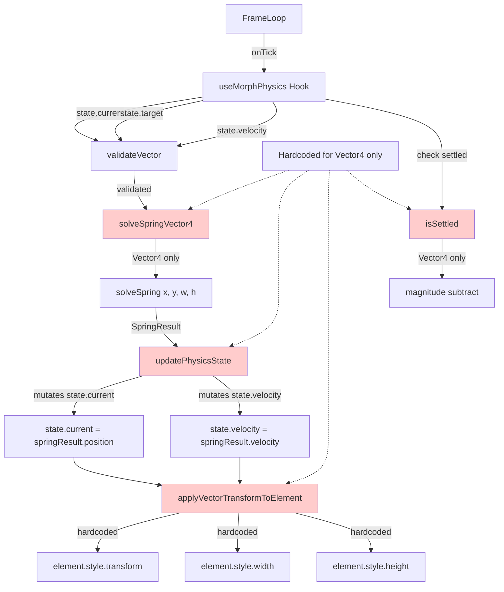
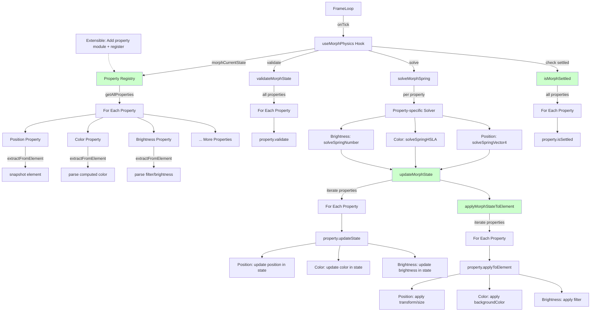
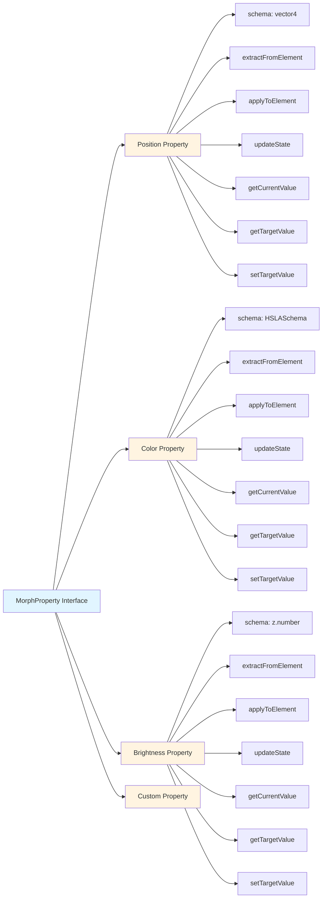

# Morph System Architecture Diagrams

## Current Structure

```mermaid
graph TD
    A[FrameLoop] -->|onTick| B[useMorphPhysics Hook]
    B -->|state.current| C[validateVector]
    B -->|state.target| C
    B -->|state.velocity| C
    C -->|validated| D[solveSpringVector4]
    D -->|Vector4 only| E[solveSpring x, y, w, h]
    E -->|SpringResult| F[updatePhysicsState]
    F -->|mutates state.current| G[state.current = springResult.position]
    F -->|mutates state.velocity| H[state.velocity = springResult.velocity]
    G --> I[applyVectorTransformToElement]
    H --> I
    I -->|hardcoded| J[element.style.transform]
    I -->|hardcoded| K[element.style.width]
    I -->|hardcoded| L[element.style.height]
    B -->|check settled| M[isSettled]
    M -->|Vector4 only| N[magnitude subtract]

    style D fill:#ffcccc
    style F fill:#ffcccc
    style I fill:#ffcccc
    style M fill:#ffcccc
    note1[Hardcoded for Vector4 only]
    note1 -.-> D
    note1 -.-> F
    note1 -.-> I
    note1 -.-> M
```

## Improved Modular Design

```mermaid
graph TD
    A[FrameLoop] -->|onTick| B[useMorphPhysics Hook]
    B -->|morphCurrentState| C[Property Registry]

    C -->|getAllProperties| D[For Each Property]
    D --> D1[Position Property]
    D --> D2[Color Property]
    D --> D3[Brightness Property]
    D --> D4[... More Properties]

    D1 -->|extractFromElement| E1[snapshot element]
    D2 -->|extractFromElement| E2[parse computed color]
    D3 -->|extractFromElement| E3[parse filter/brightness]

    B -->|validate| F[validateMorphState]
    F -->|all properties| G[For Each Property]
    G --> G1[property.validate]

    B -->|solve| H[solveMorphSpring]
    H -->|per property| I[Property-specific Solver]
    I --> I1[Position: solveSpringVector4]
    I --> I2[Color: solveSpringHSLA]
    I --> I3[Brightness: solveSpringNumber]

    I1 --> J[updateMorphState]
    I2 --> J
    I3 --> J

    J -->|iterate properties| K[For Each Property]
    K --> K1[property.updateState]
    K1 --> K1A[Position: update position in state]
    K1 --> K1B[Color: update color in state]
    K1 --> K1C[Brightness: update brightness in state]

    J --> L[applyMorphStateToElement]
    L -->|iterate properties| M[For Each Property]
    M --> M1[property.applyToElement]
    M1 --> M1A[Position: apply transform/size]
    M1 --> M1B[Color: apply backgroundColor]
    M1 --> M1C[Brightness: apply filter]

    B -->|check settled| N[isMorphSettled]
    N -->|all properties| O[For Each Property]
    O --> O1[property.isSettled]

    style C fill:#ccffcc
    style J fill:#ccffcc
    style L fill:#ccffcc
    style N fill:#ccffcc
    note2[Extensible: Add property module + register]
    note2 -.-> C
```

## Property Module Structure

```mermaid
graph LR
    A[MorphProperty Interface] --> B[Position Property]
    A --> C[Color Property]
    A --> D[Brightness Property]
    A --> E[Custom Property]

    B --> B1[schema: vector4]
    B --> B2[extractFromElement]
    B --> B3[applyToElement]
    B --> B4[updateState]
    B --> B5[getCurrentValue]
    B --> B6[getTargetValue]
    B --> B7[setTargetValue]

    C --> C1[schema: HSLASchema]
    C --> C2[extractFromElement]
    C --> C3[applyToElement]
    C --> C4[updateState]
    C --> C5[getCurrentValue]
    C --> C6[getTargetValue]
    C --> C7[setTargetValue]

    D --> D1[schema: z.number]
    D --> D2[extractFromElement]
    D --> D3[applyToElement]
    D --> D4[updateState]
    D --> D5[getCurrentValue]
    D --> D6[getTargetValue]
    D --> D7[setTargetValue]

    style A fill:#e1f5ff
    style B fill:#fff4e1
    style C fill:#fff4e1
    style D fill:#fff4e1
    style E fill:#fff4e1
```
