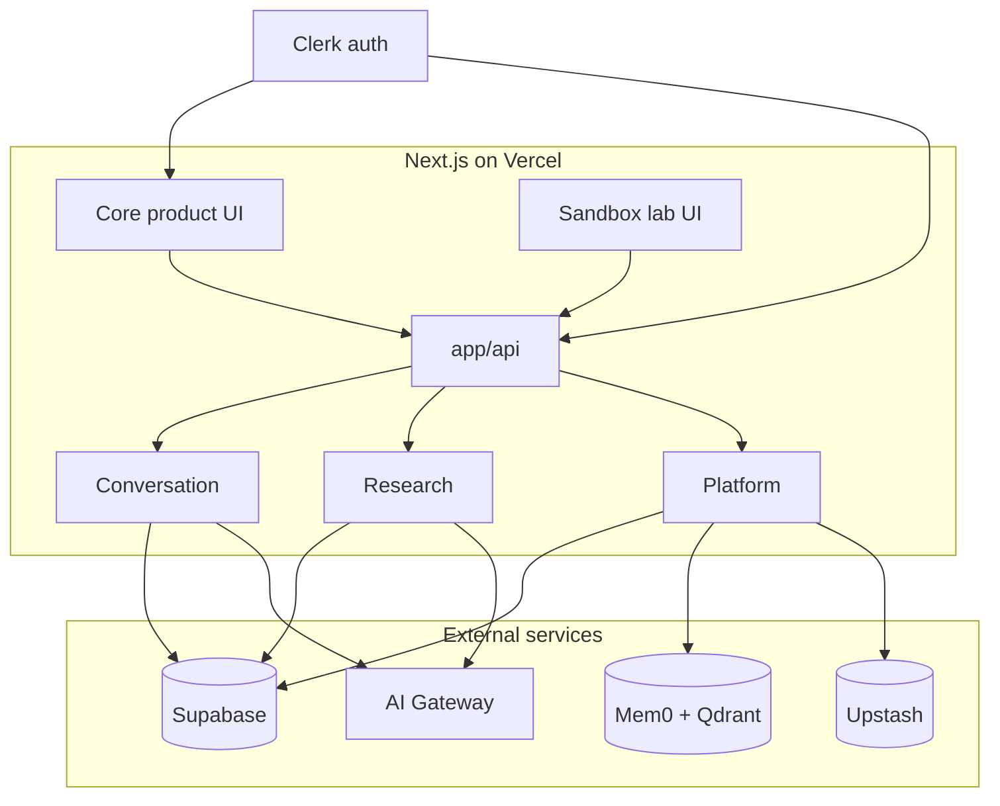

# Organic LLM

**Reimagining AI chat** — fluid, glass-forward UI with memory and context that stay fast, inspectable, and trustworthy.

## Live app

**[Open Organic LLM →](https://organic.coalescencelabs.app)**

The hosted deployment is the primary experience. Sign in for chat, rabbit-hole research, speak/TTS, settings, profile, and the sandbox lab. These paths are public without an account:

| Path | Description |
|------|-------------|
| `/showcase` | Portfolio — [Anatomy of a Response](https://organic.coalescencelabs.app/showcase/anatomy), [Memory](https://organic.coalescencelabs.app/showcase/memory) |
| `/blog` | Architecture and design writing |
| `/privacy-and-security` | Encryption and privacy overview |

## Overview

Organic LLM is a full-stack AI application and an ongoing design/research codebase:

- **Product** — threaded conversations, long-term memory, branching research (rabbit holes), structured assistant UI (Gen UI), voice/TTS, and export to external tools.
- **UI lab** — organic-glass surfaces, adaptive backgrounds, spring-driven layout morphs ([`@organic-llm/morph-physics`](./llm/morph-physics/)).
- **Cognition lab** — token-bounded context, rolling summaries, encrypted persistence, and a strict server boundary around memory operations.

Experiments under `/sandbox` (e.g. Arcadia, Strata, memory ingest) share auth and often the same thread model as production chat; stable ideas graduate into the main app or `/showcase`.

## Tech stack

| Layer | Stack |
|-------|-------|
| **App** | [Next.js 16](https://nextjs.org/), TypeScript, [Bun](https://bun.sh) |
| **UI** | Tailwind 4, Radix/shadcn, Framer Motion, [`morph-physics`](./llm/morph-physics/) |
| **AI & voice** | [Vercel AI SDK](https://sdk.vercel.ai/) + Gateway, Gen UI/tools, [ElevenLabs](https://elevenlabs.io/) TTS |
| **Services** | [Supabase](https://supabase.com/), [Clerk](https://clerk.com/), [Mem0](https://mem0.ai/), [Qdrant](https://qdrant.tech/), [Upstash](https://upstash.com/) · hosted on [Vercel](https://vercel.com/) |

## Architecture

One **Next.js application** on Vercel hosts every product surface below. They share Clerk auth, Supabase persistence, encrypted chat data, long-term memory, the AI Gateway, Upstash rate limits, and a common `app/api` + `lib` layout — but each area has its own UI, routes, and server modules.

### Application areas

| Area | Route(s) | What it does |
|------|----------|----------------|
| **Chat** | `/chat` | Main assistant — threads, streaming, tools, Gen UI cards, export to external apps |
| **Rabbit holes** | `/rabbitholes` | Branching research sessions — generated nodes, sources, browse and resume |
| **Speak** | `/speak` | Voice-first and TTS-oriented conversation flows |
| **Settings & profile** | `/settings` | Account, fonts, knowledge tree, chat preferences, Coalescence Mode |
| **Sandbox** | `/sandbox/*` | Internal lab — Arcadia, Noesis (topic explore), Strata, tasks, TTS experiments, Prometheus, memory ingest, UI prototypes |
| **Homepage** | `/` | Composer, routing into chat or plan flows |
| **Good News** | `/good-news` | Daily digest (cron + Exa + Gateway); preview mode without backend |
| **Showcase & blog** | `/showcase`, `/blog` | Public portfolio snapshots and architecture writing |

Auth: Clerk protects product routes and `/api/*` except webhooks and the Good News cron ([`proxy.ts`](./proxy.ts)). `/showcase`, `/blog`, and `/privacy-and-security` stay public.

### System diagram



| Diagram node | Maps to |
|--------------|---------|
| **Core product UI** | Chat, Rabbit Holes, Speak, Settings, and the homepage composer |
| **Sandbox lab UI** | Internal lab — Arcadia, Noesis (topic explore), Strata, tasks, TTS experiments, and UI prototypes |
| **app/api** | HTTP entry for chat, research sessions, speech, profile, sandbox prototypes, and scheduled jobs |
| **Conversation** | Thread streaming, context assembly, and encrypted storage for messages and summaries |
| **Research** | Rabbit Hole generation, resume, and browse pipelines |
| **Platform** | Long-term memory, profile and knowledge, and Redis-backed rate limits |
| **External services** | **Supabase** (app data), **Mem0 + Qdrant** (vectors), **AI Gateway** (models), **Upstash** (limits and cache) |

Showcase, blog, and privacy pages are public and mostly static — see **Application areas**.

### Shared platform

| Piece | Role across the app |
|-------|---------------------|
| [`app/api`](./app/api/) | HTTP for chat, rabbit-hole generation, TTS/speech, profile/knowledge, homepage routing, sandbox prototypes, Good News cron, webhooks |
| [`lib/chat`](./lib/chat/) | Threads, context assembly, streaming orchestration ([`chat-store`](./lib/chat/chat-store.ts)) |
| [`lib/rabbit-holes`](./lib/rabbit-holes/) | Session generation, nodes, browse metadata, client session state |
| [`lib/memory/operations`](./lib/memory/operations.ts) | Server-only long-term memory (chat, Arcadia, lenses, migration tests) |
| [`lib/crypto/message-encryption`](./lib/crypto/message-encryption.ts) | At-rest encryption for messages and summaries |
| [`components/`](./components/) | Chat, rabbit-holes, settings, design-system glass primitives, showcase, TTS |

### Example request paths

- **Chat turn** — thread UI → `POST /api/chat` → chat-store (last-N + summary + memory) → Gateway stream → encrypt → Supabase.
- **Rabbit hole** — session UI → `/api/rabbitholes/...` generate/resume → pipeline in `lib/rabbit-holes` → Supabase session tables + Gateway.
- **TTS / speak** — UI → `/api/ai/tts*` or speech routes → ElevenLabs + Gateway copy transforms.
- **Profile** — settings → `/api/profile/*` → Supabase profile/knowledge + Gateway classifiers.
- **Good News** — Vercel cron → `/api/good-news/cron` → Exa + Gateway → digest rows in Supabase.
- **Sandbox** — prototype pages call dedicated `/api/sandbox/*`, `/api/prototypes/*`, or reuse chat/Aion routes.

### Chat context model

Applies to **chat** (and Arcadia-style threads that share the same store):

1. **Threads** — `threads`, `messages`, `thread_summaries` in Supabase.
2. **Last-N window** — only recent turns go to the model.
3. **Rolling summaries** — encrypted narrative, refreshed on a cadence.
4. **Memory** — Mem0/Qdrant via [`lib/memory/operations.ts`](./lib/memory/operations.ts).
5. **UI contract** — full history on screen; bounded context to the model.

More detail: [threads & sessions](./docs/thread-session-architecture.md) · [context assembly](./docs/architecture/context-building.md) · [Arcadia](./docs/arcadia.md) · [chat pipeline (blog)](https://organic.coalescencelabs.app/blog/chat-message-flow) · [encryption](./docs/e2ee.md).

## Documentation

- **[Documentation index](./docs/INDEX.md)** — all architecture and module guides
- **Blog** — [/blog](https://organic.coalescencelabs.app/blog) (memory encryption, chat pipeline, export presets, adaptive background)
- **[Security policy](./SECURITY.md)** — reporting and secrets hygiene
- **[Open-source audit](./docs/OPEN_SOURCE_AUDIT.md)** — pre-public checklist for contributors

## Roadmap

**Shipped** — chat, rabbit holes, speak/TTS, profile/settings, memory, encryption, sandbox lab, showcase, blog, Good News (in development).

**Experimental** — deep history search/chunks; sandbox prototypes (Strata, memory ingest).

**Planned** — thread chapters, artifact ingestion, richer observability and governance.

## Principles

Composable features on a stable thread spine; token-aware context; transparent security design; full history in the UI with lean model context as optimization.

---

## Running locally

For contributors and self-hosters. The hosted app above is the default way to explore the product.

### Quick preview (no API keys)

**Prerequisites:** Node.js ≥ 20, [Bun](https://bun.sh).

```bash
git clone https://github.com/alexjoshua14/organic-llm.git
cd organic-llm
bun install
bun dev
```

Open [localhost:3000/showcase](http://localhost:3000/showcase), [/blog](http://localhost:3000/blog), or [/good-news?preview=1](http://localhost:3000/good-news?preview=1). No `.env.local` required for those routes.

### Full stack on your machine

Bring your own **Clerk** app and **Supabase** project (schema snippets in [`docs/migrations/`](./docs/migrations/)).

```bash
cp .env.example .env.local
# Clerk, Supabase URL + anon + service role, plus optional:
# OPENAI_API_KEY, EXA_API_KEY, ELEVENLABS_API_KEY, MEMORY_API_*, UPSTASH_*,
# ORGANIC_LLM_* encryption — see .env.example and docs/OPEN_SOURCE_AUDIT.md
bun dev
```

- Product routes after sign-in: `/chat`, `/rabbitholes`, `/sandbox`
- Health: `/status` when env is configured
- Types: `bun run supabase:types` (requires `supabase link` locally)
- Clerk webhooks: `bun run dev:full`

### Deploy yourself

Typical path: **Vercel** + env vars from `.env.example`, Supabase, Clerk, and optional Upstash / Qdrant / memory encryption keys. Cron for Good News is defined in [`vercel.json`](./vercel.json). Do not commit `.env.local` or `supabase/.temp/` — see [SECURITY.md](./SECURITY.md).

> `package.json` sets `"private": true` for npm; the app is open source on GitHub, not published as an npm application package.

## Development

```bash
bun run lint:check
bun run test          # unit + integration
bun run test:e2e      # Playwright (E2E_CLERK_* for signed-in flows)
```

CI runs tests on `main` PRs; `llm/morph-physics` has a separate workflow when that package changes.

### Repository layout

```
app/           Routes — chat, blog, showcase, sandbox, api
components/    UI, chat, rabbit-holes, design-system
lib/           Chat store, LLM, memory, crypto, rate limits
llm/           morph-physics and future packages
docs/          Architecture — docs/INDEX.md
tests/         Bun + Playwright
```

## License

- Application: [MIT](./LICENSE)
- [`llm/morph-physics`](./llm/morph-physics/): [Apache-2.0](./llm/morph-physics/LICENSE)
