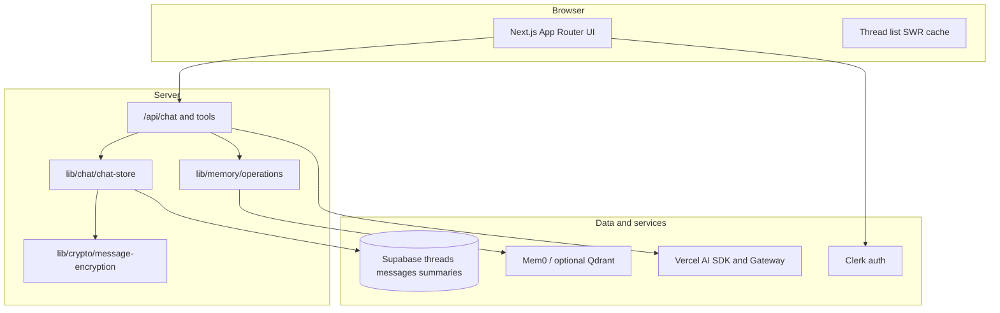

# Organic LLM

**Reimagining AI chat** — fluid, glass-forward UI with memory and context that stay fast, inspectable, and trustworthy.

## Live app

**[Open Organic LLM →](https://organic.coalescencelabs.app)**

The hosted deployment is the primary experience. Sign in to use chat, rabbit holes, settings, and sandbox labs. These paths are public without an account:

| Path | Description |
|------|-------------|
| `/showcase` | Portfolio — [Anatomy of a Response](https://organic.coalescencelabs.app/showcase/anatomy), [Memory](https://organic.coalescencelabs.app/showcase/memory) |
| `/blog` | Architecture and design writing |
| `/privacy-and-security` | Encryption and privacy overview |

## Overview

Organic LLM is a full-stack AI chat product and an ongoing design/research codebase:

- **Product** — threaded conversations, long-term memory, branching research (rabbit holes), structured assistant UI (Gen UI), voice/TTS, and export to external tools.
- **UI lab** — organic-glass surfaces, adaptive backgrounds, spring-driven layout morphs ([`@organic-llm/morph-physics`](./llm/morph-physics/)).
- **Cognition lab** — token-bounded context, rolling summaries, encrypted persistence, and a strict server boundary around memory operations.

Experiments under `/sandbox` (e.g. Arcadia, Strata, memory ingest) share auth and often the same thread model as production chat; stable ideas graduate into the main app or `/showcase`.

## Tech stack

| Layer | Stack |
|-------|-------|
| **App** | [Next.js 16](https://nextjs.org/) (App Router — React UI, API routes, RSC/server logic), TypeScript, [Bun](https://bun.sh) |
| **UI** | Tailwind 4, Radix/shadcn, Framer Motion, [`morph-physics`](./llm/morph-physics/) |
| **AI & voice** | [Vercel AI SDK](https://sdk.vercel.ai/) + Gateway, Gen UI/tools, [ElevenLabs](https://elevenlabs.io/) TTS |
| **Services** | [Supabase](https://supabase.com/), [Clerk](https://clerk.com/), [Mem0](https://mem0.ai/) (+ optional [Qdrant](https://qdrant.tech/)), optional [Upstash](https://upstash.com/) · hosted on [Vercel](https://vercel.com/) |

## Architecture

### Layers



| Layer | Role | Primary code |
|-------|------|----------------|
| **UI** | Full message history in the scroll surface; lean payload to the model | `components/chat/`, `app/chat/` |
| **API** | Streaming, tools, Gen UI events, rate limits | `app/api/chat/` |
| **Chat store** | Create/load/save threads; assemble context before `streamText` | [`lib/chat/chat-store.ts`](./lib/chat/chat-store.ts) |
| **Persistence** | Postgres via Supabase; RLS owner-scoped to Clerk user | `data/supabase/` |
| **Encryption** | AES at rest for message bodies and summary fields | [`lib/crypto/message-encryption.ts`](./lib/crypto/message-encryption.ts), [E2EE notes](./docs/e2ee.md) |
| **Memory** | Search/add/delete via server-only API; no client-supplied `userId` | [`lib/memory/README.md`](./lib/memory/README.md) |

Deep dives: [thread & session architecture](./docs/thread-session-architecture.md), [context building](./docs/architecture/context-building.md), [chat message flow (blog)](https://organic.coalescencelabs.app/blog/chat-message-flow).

### Context model

1. **Threads** — one conversation (`threads`, `messages`, `thread_summaries` in Supabase).
2. **Last-N window** — only recent turns are sent to the model.
3. **Rolling summaries** — encrypted narrative per thread, updated on a cadence so older turns need not be resent.
4. **Memory** — Mem0-backed facts retrieved and written through [`lib/memory/operations.ts`](./lib/memory/operations.ts).
5. **UI contract** — users always browse full history; the model sees a bounded, token-aware context.

### Major surfaces

| Surface | Purpose |
|---------|---------|
| **Chat** (`/chat`) | Main assistant — streaming, tools, Gen UI, export presets |
| **Rabbit holes** (`/rabbitholes`) | Multi-step research sessions with generated nodes |
| **Arcadia** (`/sandbox/arcadia`) | Sandbox chat on shared threads — prompts and UI experiments |
| **Speak** (`/speak`) | TTS-oriented flows |
| **Sandbox** (`/sandbox`) | Prototypes gallery (tasks, morph lab, Strata, memory ingest, …) |
| **Showcase** (`/showcase`) | Public, fixed snapshots for portfolio review |
| **Good News** (`/good-news`) [In Development] | Fact-checked optimistic digest (scheduled job on deploy) |

Auth: Clerk protects `/chat`, `/rabbitholes`, `/sandbox`, `/settings`, `/speak`, `/status`, and `/api/*` except webhooks and the Good News cron. See [`proxy.ts`](./proxy.ts).

## Documentation

- **[Documentation index](./docs/INDEX.md)** — all architecture and module guides
- **Blog** — [/blog](https://organic.coalescencelabs.app/blog) (memory encryption, chat pipeline, export presets, adaptive background)
- **[Security policy](./SECURITY.md)** — reporting and secrets hygiene
- **[Open-source audit](./docs/OPEN_SOURCE_AUDIT.md)** — pre-public checklist for contributors

## Roadmap

**Shipped** — persistence, encryption, rolling summaries, memory, rabbit holes, export, showcase, blog, Arcadia sandbox.

**Experimental** — deep history search/chunks; sandbox prototypes (Strata, memory ingest).

**Planned** — thread chapters, artifact ingestion, richer observability and governance.

## Principles

Composable features on a stable thread spine; token-aware context; transparent security design; full history in the UI with lean model context as optimization.

---

## Running locally

For contributors and self-hosters. The hosted app above is the default way to explore the product.

### Quick preview (no API keys)

**Prerequisites:** Node.js ≥ 20, [Bun](https://bun.sh).

```bash
git clone https://github.com/alexjoshua14/organic-llm.git
cd organic-llm
bun install
bun dev
```

Open [localhost:3000/showcase](http://localhost:3000/showcase), [/blog](http://localhost:3000/blog), or [/good-news?preview=1](http://localhost:3000/good-news?preview=1). No `.env.local` required for those routes.

### Full stack on your machine

Bring your own **Clerk** app and **Supabase** project (schema snippets in [`docs/migrations/`](./docs/migrations/)).

```bash
cp .env.example .env.local
# Clerk, Supabase URL + anon + service role, plus optional:
# OPENAI_API_KEY, EXA_API_KEY, ELEVENLABS_API_KEY, MEMORY_API_*, UPSTASH_*,
# ORGANIC_LLM_* encryption — see .env.example and docs/OPEN_SOURCE_AUDIT.md
bun dev
```

- Product routes after sign-in: `/chat`, `/rabbitholes`, `/sandbox`
- Health: `/status` when env is configured
- Types: `bun run supabase:types` (requires `supabase link` locally)
- Clerk webhooks: `bun run dev:full`

### Deploy yourself

Typical path: **Vercel** + env vars from `.env.example`, Supabase, Clerk, and optional Upstash / Qdrant / memory encryption keys. Cron for Good News is defined in [`vercel.json`](./vercel.json). Do not commit `.env.local` or `supabase/.temp/` — see [SECURITY.md](./SECURITY.md).

> `package.json` sets `"private": true` for npm; the app is open source on GitHub, not published as an npm application package.

## Development

```bash
bun run lint:check
bun run test          # unit + integration
bun run test:e2e      # Playwright (E2E_CLERK_* for signed-in flows)
```

CI runs tests on `main` PRs; `llm/morph-physics` has a separate workflow when that package changes.

### Repository layout

```
app/           Routes — chat, blog, showcase, sandbox, api
components/    UI, chat, rabbit-holes, design-system
lib/           Chat store, LLM, memory, crypto, rate limits
llm/           morph-physics and future packages
docs/          Architecture — docs/INDEX.md
tests/         Bun + Playwright
```

## License

- Application: [MIT](./LICENSE)
- [`llm/morph-physics`](./llm/morph-physics/): [Apache-2.0](./llm/morph-physics/LICENSE)
