# useRabbitHoles Architecture

```mermaid
graph TB
    Hook["useRabbitHoles Hook"]

    Hook --> StateGroup
    Hook --> ActionGroup
    Hook --> InternalHelpers
    Hook --> DepGroup

    subgraph StateGroup["📊 Exposed State"]
        direction TB
        S1["session"]
        S2["isLoading"]
        S3["generatingNodeId"]
        S4["preview"]
        S5["error"]
        S6["selectedSourceId"]
        S7["sourceAnalysis"]
        S8["isAnalyzingSource"]
    end

    subgraph ActionGroup["⚙️ Exposed Actions"]
        direction TB
        A1["newSession()"]
        A2["loadExistingSession()"]
        A3["exploreQuestion()"]
        A4["selectSource()"]
        A5["clearSourceSelection()"]
        A6["resetSourceAnalysisState()"]
        A7["setActiveNode()"]
        A8["reset()"]
        A9["saveSessionToStorage()"]
    end

    subgraph InternalHelpers["🔧 Internal Helpers"]
        direction TB
        H1["createNode()<br/>(internal)"]
        H2["getStoredSession()<br/>(internal, not implemented)"]
        H3["saveSessionToStorage()<br/>(internal, not implemented)"]
    end
    
    subgraph DepGroup["🔗 External Dependencies"]
        direction TB
        D1["generateQuickPreview<br/>app/rabbitholes/actions.ts"]
        D2["generateRabbitHoleNode<br/>lib/rabbit-holes/actions.ts"]
        D5["React hooks<br/>useState, startTransition"]
        D6["createLogger"]
        D7["randomUUID"]
    end

    A3 -.->|uses| D1
    A3 -.->|uses| D2
    A2 -.->|uses| D3
    A9 -.->|uses| D4

    style Hook fill:#e1f5ff,stroke:#0066cc,stroke-width:3px
    style StateGroup fill:#d4edda,stroke:#28a745
    style ActionGroup fill:#fff3cd,stroke:#ffc107
    style DepGroup fill:#f8d7da,stroke:#dc3545
    style A3 fill:#ffeaa7,stroke:#fdcb6e,stroke-width:2px
    style D1 fill:#fab1a0
    style D2 fill:#fab1a0
```



## Overview

`useRabbitHoles` is a React hook that manages the complete lifecycle of Rabbit Hole exploration sessions. It provides state management and orchestration for creating sessions, exploring questions, generating content, and managing user interactions with sources and nodes.

## Data Structure

### Session vs Node

**Session** (`RabbitHoleSession`): Container for an entire exploration journey
- One session = one exploration session (can span multiple questions/nodes)
- Contains metadata: `sessionId`, `rootQuestion`, `createdAt`, `updatedAt`
- Manages navigation: `activeNodeId` (currently viewed node)
- Tracks structure: `path` (linear navigation), `edges` (graph connections), `nodesById` (all nodes)

**Node** (`RabbitHoleNode`): Individual exploration point
- One node = one question/exploration with generated content
- Contains content: `articleHtml`, `keyTakeaways`, `sources`, `branchSuggestions`
- Has identity: `id` (UUID), `userQuestion`, `createdAt`
- Represents a single "rabbit hole" dive into a topic

**Relationship**: Session contains multiple nodes. Nodes are the building blocks; session is the container.

### Node Storage Architecture

Nodes stored using **hybrid graph + key-value** structure:

**1. `nodesById: Record<string, RabbitHoleNode>`** (Key-Value Store)
- Primary storage: `{ [nodeId]: RabbitHoleNode }`
- Fast O(1) lookup by ID
- Stores all node data (content, sources, etc.)
- Allows nodes to exist outside linear path

**2. `path: RabbitHolePathSegment[]`** (Linear Navigation)
- Ordered array representing user's navigation history
- Each segment: `{ nodeId, label, parentNodeId }`
- Defines sequential exploration flow
- Used for breadcrumbs, back/forward navigation
- May not include all nodes (only those in current path)

**3. `edges: RabbitHoleEdge[]`** (Graph Connections)
- Array of `{ from: nodeId, to: nodeId }` pairs
- Represents graph structure (can branch/reconnect)
- Enables non-linear navigation
- Supports future features: branching, revisiting nodes

**Example Structure**:
```
Session {
  nodesById: {
    "node-1": { id: "node-1", userQuestion: "What is AI?", ... },
    "node-2": { id: "node-2", userQuestion: "How does ML work?", ... },
    "node-3": { id: "node-3", userQuestion: "What are neural networks?", ... }
  },
  path: [
    { nodeId: "node-1", label: "What is AI?", parentNodeId: null },
    { nodeId: "node-2", label: "How does ML work?", parentNodeId: "node-1" },
    { nodeId: "node-3", label: "What are neural networks?", parentNodeId: "node-2" }
  ],
  edges: [
    { from: "node-1", to: "node-2" },
    { from: "node-2", to: "node-3" }
  ],
  activeNodeId: "node-3"  // Currently viewing node-3
}
```

**Why This Structure?**
- **Key-value** (`nodesById`): Fast access, stores complete node data
- **Path array**: Maintains linear navigation order, simple iteration
- **Edges array**: Enables graph operations (branching, cycles, revisiting)
- **Separation**: Path is navigation history; nodesById is data store; edges is graph structure

## Exposed API

### State Properties

The hook exposes the following reactive state:

- **`session`**: The current `RabbitHoleSession` object containing all nodes (`nodesById`), navigation (`path`, `activeNodeId`), and metadata, or `null` if no session exists
- **`isLoading`**: Boolean indicating if any async operation is in progress
- **`generatingNodeId`**: The ID of the node currently being generated, or `null` if none
- **`preview`**: Quick preview text shown while full content is being generated, or `null`
- **`error`**: Error message string if an operation failed, or `null`
- **`selectedSourceId`**: ID of the currently selected source for analysis, or `null`
- **`sourceAnalysis`**: Analysis result for the selected source, or `null`
- **`isAnalyzingSource`**: Boolean indicating if source analysis is in progress

#### Loading States: Blocking vs Non-Blocking

The hook uses two distinct loading states to manage different types of operations:

**`isLoading` (Blocking/Urgent)**
- Used for **urgent, blocking operations** that must complete before proceeding
- Tracks: session creation, validation, quick preview generation
- When `isLoading` is `true`, the UI should show a blocking loading indicator
- These operations are synchronous or fast async work that blocks the main flow

**`isGeneratingNode` (Non-Blocking/Transition)**
- Used for **non-urgent, interruptible work** via React's `useTransition`
- Tracks: heavy node content generation (`generateRabbitHoleNode`)
- When `isGeneratingNode` is `true`, the UI can remain interactive
- These operations run in a transition, allowing React to:
  - Keep the UI responsive during generation
  - Interrupt the work if more urgent updates arrive
  - Batch state updates efficiently

**Why Two States?**
- **Separation of concerns**: Setup/preview (urgent) vs content generation (can wait)
- **Better UX**: Users see immediate feedback from preview while heavy work happens in background
- **Performance**: Non-blocking transitions prevent UI freezes during long-running operations

**Usage Pattern**:
```typescript
// Blocking phase: Setup and preview
setIsLoading(true);
await generateQuickPreview(question);
setIsLoading(false);

// Non-blocking phase: Heavy generation
startTransition(async () => {
  await generateRabbitHoleNode(session, nodeId);
});
// isGeneratingNode automatically tracks this transition
```

### Action Methods

#### `newSession(): void`

Creates a new empty session with a fresh UUID. Initializes an empty session structure with no nodes or path.

#### `loadExistingSession(sessionId: string): SimpleResult`

Loads an existing session by ID from storage. Currently returns a result but doesn't actually load the session (implementation pending).

#### `exploreQuestion(question: string): Promise<SimpleResult>`

**Primary exploration method.** This is the main entry point for exploring a question:

1. Validates the question input
2. Creates a new session if one doesn't exist
3. Creates a new node structure for the question
4. Adds node to `nodesById` (key-value store) and `path` (navigation array)
5. Generates a quick preview (via `generateQuickPreview`)
6. Updates session state optimistically
7. Triggers full node generation in background (via `generateRabbitHoleNode` using `startTransition`)
8. Updates session with complete node content when ready

Returns a `SimpleResult` indicating success or failure.

#### `selectSource(source: RabbitHoleSource): Promise<void>`

Selects a source for detailed analysis. Currently stubbed (not implemented).

#### `clearSourceSelection(): void`

Clears the currently selected source and its analysis. Currently stubbed (not implemented).

#### `resetSourceAnalysisState(): void`

Resets all source analysis state including cache. Currently stubbed (not implemented).

#### `setActiveNode(nodeId: RabbitHoleNodeId): void`

Changes the active node in the session, allowing navigation between nodes. Currently stubbed (not implemented).

#### `reset(): void`

Clears all session state and resets the hook to initial state. Currently stubbed (not implemented).

#### `saveSessionToStorage(session: RabbitHoleSession | null): Promise<void>`

Persists the session to storage. Currently stubbed (not implemented).

## Dependencies

### External Server Actions

#### `generateQuickPreview(question: string)`

**Location**: `app/rabbitholes/actions.ts`

Generates a quick text preview of what will be explored for a given question. Used by `exploreQuestion` to provide immediate feedback while full content is generated.

**Returns**: `Result<string>` - The preview text or an error

#### `generateRabbitHoleNode(session: RabbitHoleSession, nodeId: string)`

**Location**: `lib/rabbit-holes/actions.ts`

Performs the heavy lifting of generating complete node content:

- Refines the user question using LLM
- Fetches external sources via Exa
- Builds path history context
- Generates full article HTML, key takeaways, and branch suggestions
- Updates the node with all generated content

**Returns**: `Result<RabbitHoleSession>` - Updated session with complete node content

**Note**: This runs in a `startTransition` to avoid blocking the UI during generation.

### Internal Helpers (Not Implemented)

#### `getStoredSession(sessionId?: string): Promise<RabbitHoleSession | null>`

Should retrieve a stored session from localStorage or database. Currently returns `null`.

#### `saveSessionToStorage(session: RabbitHoleSession | null): Promise<void>`

Should persist a session to storage. Currently a no-op.

### React Dependencies

- **`useState`**: Manages all hook state (session, loading, error, etc.)
- **`startTransition`**: Wraps heavy async work (node generation) to keep UI responsive

### Utilities

- **`createLogger`**: Logging utility for debugging and error tracking
- **`randomUUID`**: Generates unique IDs for sessions and nodes

## Data Flow

### Exploration Flow (`exploreQuestion`)

```
User Input (question)
    ↓
Validate & Create Session (if needed)
    ↓
Create Empty Node Structure
    ↓
Add Node to nodesById + path
    ↓
Generate Quick Preview (async) ──→ Update preview state
    ↓
Update Session Optimistically
    ↓
startTransition {
    Generate Full Node Content (async)
        ↓
    Update Session with Complete Content
}
    ↓
Return Success Result
```

### State Updates

The hook uses React's `useState` for all state management. State updates follow this pattern:

1. **Optimistic Updates**: Session structure is updated immediately when a node is created
2. **Progressive Enhancement**: Preview is shown first, then full content replaces it
3. **Non-blocking**: Heavy generation work happens in `startTransition` to keep UI responsive
4. **Error Handling**: Errors are captured in state and exposed via `error` property

## Implementation Status

### ✅ Implemented

- `newSession()` - Creates empty sessions
- `exploreQuestion()` - Full exploration flow with preview and generation
- State management for all exposed properties
- Integration with `generateQuickPreview` and `generateRabbitHoleNode`

### ⚠️ Partially Implemented

- `loadExistingSession()` - Structure exists but doesn't actually load sessions
- Return statement - Currently missing some methods from the interface

### ❌ Not Implemented

- `selectSource()` - Source analysis functionality
- `clearSourceSelection()` - Source state management
- `resetSourceAnalysisState()` - Analysis cache clearing
- `setActiveNode()` - Node navigation
- `reset()` - Full state reset
- `saveSessionToStorage()` / `getStoredSession()` - Storage persistence

## Type Definitions

All types are imported from `@/lib/schemas/rabbitHoleSchemas`:

- `RabbitHoleSession` - Container for entire exploration (contains nodes, path, edges)
- `RabbitHoleNode` - Individual exploration point with content (article, takeaways, sources)
- `RabbitHoleNodeId` - UUID string type for node identifiers
- `RabbitHolePathSegment` - Path entry: `{ nodeId, label, parentNodeId }`
- `RabbitHoleEdge` - Graph connection: `{ from: nodeId, to: nodeId }`
- `RabbitHoleSource` - External source reference
- `RabbitHoleSourceAnalysis` - Analyzed source content

## Notes

- The hook is designed to be the primary interface for Rabbit Hole functionality
- Heavy operations are intentionally non-blocking using React's `startTransition`
- Error states are managed but don't prevent continued operation
- The hook maintains optimistic UI updates for better perceived performance
