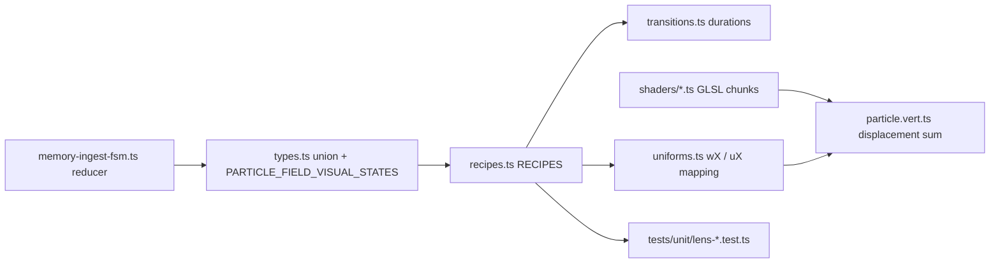

# Adding a new particle visual state (Memory Lens)

This guide is written so an LLM (or human) can extend the **v1 particle visual vocabulary** end-to-end without guessing file order. The stack is **Tier 0**: analytic fields in the **vertex shader**, recipe-driven weights, no neighbor lookups and no CPU per-particle simulation.

## Mental model




- `**ParticleFieldVisualState**` is the canonical name list for UI, FSM, and lens.
- `**StateName**` in the lens is an alias of the same union — keep them identical.
- `**RECIPES[state]**` defines targets for **fields** (shader weights) and **modulators** (`tempo`, `coherence`, `energy`, `anisotropy`).
- `**StateManager`** lerps from the current blended recipe to the next target over `**resolveDuration(from, to)`** milliseconds.
- `**LensPoints**` applies the blended recipe to uniforms each frame; motion clocks integrate phase separately from wall time where implemented.

## Checklist (do in order)

### 1) Name the state in the type system


| File                                   | Action                                                                                 |
| -------------------------------------- | -------------------------------------------------------------------------------------- |
| `[../_lib/types.ts](../_lib/types.ts)` | Add the new string literal to `ParticleFieldVisualState`.                              |
| `[../_lib/types.ts](../_lib/types.ts)` | Append the same string to `PARTICLE_FIELD_VISUAL_STATES` (order = dev dropdown order). |


`StateName` in `[../_lib/lens/fieldLibrary.ts](../_lib/lens/fieldLibrary.ts)` is `ParticleFieldVisualState` — no duplicate string list to maintain.

### 2) Give it a recipe (required)


| File                                                 | Action                                                      |
| ---------------------------------------------------- | ----------------------------------------------------------- |
| `[../_lib/lens/recipes.ts](../_lib/lens/recipes.ts)` | Add `your_state: { fields: { ... }, modulators: { ... } }`. |


**Fields** (`FieldWeights` keys) are weights in `[0, 1]` passed to the GPU as `w*` uniforms. Only keys you set are non-zero after blending; missing keys behave as zero in lerps.

**Modulators:**

- `tempo`, `coherence`, `energy` — scalars; used by shader and motion-clock rate mapping.
- `anisotropy` — `[x, y, z]`; direction for fields that care (e.g. absorption intake axis, tendril reach sign). Use `[0,0,0]` when isotropic fallback is desired.

Start by **cloning and tweaking** a neighboring state’s recipe, then tune.

### 3) Transition timing (optional but recommended)


| File                                                         | Action                                                                          |
| ------------------------------------------------------------ | ------------------------------------------------------------------------------- |
| `[../_lib/lens/transitions.ts](../_lib/lens/transitions.ts)` | Add or adjust rows in `TRANSITION_OVERRIDES` for pairs involving the new state. |


Rules:

- First matching override wins (`from` / `to` optional; `cognitive` matches `reasoning` and `searching_memory`).
- Unlisted pairs fall back to `DEFAULT_DURATION_MS` (500).

### 4) Wire runtime behavior (when should this state appear?)


| File                                                           | Action                                                                               |
| -------------------------------------------------------------- | ------------------------------------------------------------------------------------ |
| `[../_lib/memory-ingest-fsm.ts](../_lib/memory-ingest-fsm.ts)` | Return the new visual from `memoryIngestReducer` branches and/or `aiActionToVisual`. |


Typical touch points:

- `**DRAFT`** — `idle_ready` vs `listening` from composer text (`idle` in design docs means `idle_ready`).
- `**SUBMIT` / `STATUS_*`** — ingest / streaming.
- `**AI_ACTION**` — map `ChatAIActionEnum` and tool names to visuals.
- `**FINISH` / `RECEIPT_DONE` / `ERROR`** — return to `idle_ready` or receipt states.

Use `**DEBUG_SET**` only for dev overlay; production paths should not depend on it.

### 5) Optional: new GPU behavior

If existing fields are enough, **skip this step**.

Otherwise:


| File                                                                             | Action                                                                                        |
| -------------------------------------------------------------------------------- | --------------------------------------------------------------------------------------------- |
| `[../_lib/lens/fieldLibrary.ts](../_lib/lens/fieldLibrary.ts)`                   | Add a documented optional property on `FieldWeights` + append to `ALL_FIELD_NAMES`.           |
| `[../_lib/lens/shaders/fields/<name>.ts](../_lib/lens/shaders/fields/)`          | Export `FIELD_*_GLSL` string with `vec3 fieldFoo(...)` or scalar helper.                      |
| `[../_lib/lens/shaders/particle.vert.ts](../_lib/lens/shaders/particle.vert.ts)` | Import chunk, add to `buildShader([...])`, add `disp += wFoo * fieldFoo(...)` (or shape mix). |
| `[../_lib/lens/uniforms.ts](../_lib/lens/uniforms.ts)`                           | Add `wFoo` default in `createLensParticleUniforms` and assign in `applyRecipeToUniforms`.     |


Keep fields **pure functions** of `(position, aId, uniforms)` — no textures or neighbor loops.

### 6) Optional: lens-only tuning


| File                                                             | When                                                                 |
| ---------------------------------------------------------------- | -------------------------------------------------------------------- |
| `[../_lib/lens/motion-clocks.ts](../_lib/lens/motion-clocks.ts)` | Adjust how `tempo` / `coherence` drive integrated phase channels.    |
| `[../_lib/lens/device-tier.ts](../_lib/lens/device-tier.ts)`     | Particle count / DPR / target FPS per hardware tier (not per-state). |


### 7) UI / dev tools (if humans need to pick the state)


| File                                                                                                             | Action                                                                           |
| ---------------------------------------------------------------------------------------------------------------- | -------------------------------------------------------------------------------- |
| `[../_components/MemoryIngestDebugPanel.tsx](../_components/MemoryIngestDebugPanel.tsx)`                         | Uses `PARTICLE_FIELD_VISUAL_STATES` — updates automatically if array is correct. |
| `[../_components/MemoryIngestParticleModeDevOverlay.tsx](../_components/MemoryIngestParticleModeDevOverlay.tsx)` | Same.                                                                            |


### 8) Tests (required before merge)


| File                                                                                            | Action                                                                                                                                   |
| ----------------------------------------------------------------------------------------------- | ---------------------------------------------------------------------------------------------------------------------------------------- |
| `[tests/unit/lens-recipes.test.ts](../../../../../tests/unit/lens-recipes.test.ts)`             | New state must satisfy existing invariants (field keys valid, non-empty fields, etc.). Add assertions specific to your recipe if useful. |
| `[tests/unit/lens-state-manager.test.ts](../../../../../tests/unit/lens-state-manager.test.ts)` | Add or adjust tests if transition timing or interruptible blending behavior depends on the new state.                                    |
| `[tests/unit/lens-transitions.test.ts](../../../../../tests/unit/lens-transitions.test.ts)`     | Add rows if you introduced new `TRANSITION_OVERRIDES` pairs.                                                                             |


Run:

```bash
bun test tests/unit/lens-
```

### 9) Documentation (human + LLM)


| File                                                           | Action                                                                   |
| -------------------------------------------------------------- | ------------------------------------------------------------------------ |
| [PARTICLE_STATE_INTENTIONS.md](./PARTICLE_STATE_INTENTIONS.md) | Add a row for the new state: product intention + how motion should read. |
| `[../README.md](../README.md)`                                 | Update the v1 vocabulary table if the public meaning of a state changed. |


## Verification (manual)

1. Open a memory-ingest thread with dev UI (`?memoryIngestDev=1` per README).
2. Pick the new state from the bug panel / particle debug list.
3. Confirm motion matches intention; rapid toggle neighbors to check for pops (phase + transition duration).
4. Watch browser console for `THREE.WebGLProgram` errors.

## Common pitfalls

- **Typo in union** — TypeScript will catch missing `RECIPES` key if `Record<StateName, StateRecipe>` is intact.
- **Duration feels wrong** — add explicit `TRANSITION_OVERRIDES` for the pair; defaults are 500ms.
- **Anisotropy ignored** — several fields normalize `uAnisotropy`; near-zero length uses a fallback axis. Set a non-zero vector when direction matters.
- **Field weight exists but no motion** — weight is in `recipes.ts` but GLSL not wired in `particle.vert.ts` / `uniforms.ts`, or chunk not in `buildShader`.

## Related reading

- [PARTICLE_STATE_INTENTIONS.md](./PARTICLE_STATE_INTENTIONS.md) — living design intent per state.
- [../README.md](../README.md) — routes, dev flags, perf HUD.

