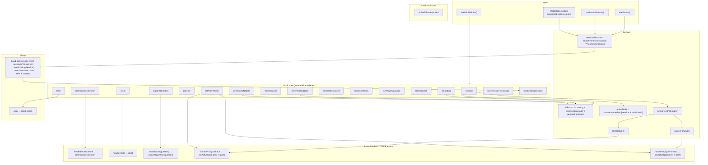
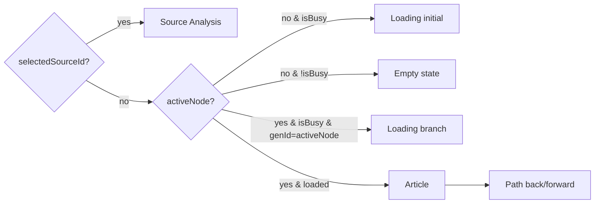

# RabbitHoleShell — State & Flow

Concise view of how **RabbitHoleShell** wires routing, context, the `useRabbitHoles` hook, and UI (lines 41–163).

## Data flow (summary)

| Source                  | Used for                                                                                                    |
| ----------------------- | ----------------------------------------------------------------------------------------------------------- |
| **URL** `?sessionId=`   | Opening a past session from browse; cleared after load.                                                     |
| **Context** `sessionId` | Same ID passed from browse when navigating in-app.                                                          |
| **useRabbitHoles**      | All session/node state, loading flags, and actions (explore, follow, select source, path nav, reset, save). |
| **Derived**             | `activeNode` (current article/sources), `isBusy`, path index and back/forward eligibility.                  |

## Center content (which panel?)

- **Path navigation** uses `session.path` and `session.activeNodeId`; back/forward just call `setActiveNode(prev|next)`.
- **Prompt bar** calls `exploreQuestion` (start) or `reset` (new rabbit hole); disabled when `isBusy`.
