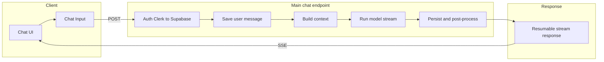

# Chat Message Flow

This page describes the main path a message takes from the chat UI to the API and back: how the client sends a message, how the server builds context and streams a response, and what makes this flow reliable and resumable.

## Problem statement

We need a reliable, resumable chat flow: the user sends a message, the server builds context (history, summaries, memory), calls the LLM with tools, streams the response, and persists it—with minimal latency and support for refresh or reconnect. The design had to support multiple personas, optional tools (web search, memory), and post-response work (titles, summaries, memory) without blocking the stream.

## What's implemented

### Client

- The **Chat** component uses `useChat` from Vercel's AI SDK with a default chat transport.
- Requests go to the main chat endpoint (optionally scoped by persona).
- **Chat input** calls `sendMessage({ text, files })`, which triggers a POST containing the user's latest message, selected model, and whether web search, memory, and zero data retention are enabled (plus additional chat settings).

### Server

- **Main chat request flow:**
  1. Auth: Clerk → Supabase.

  Clerk handles authentication. Supabase provides the app-side user mapping and data authorization boundary.
  2. Validate the request payload and settings.
  3. Save the user's message right away so the UI and persisted history stay in sync.
  4. In parallel: **(a)** Build context by gathering recent messages, conversation summary, optional memory retrieval, and optional persisted schemas. **(b)** Compile the system prompt using that context plus persona and request settings.
  5. Prepare tools for this turn (web search, memory lookup, and conversation-history retrieval when needed).
  6. Start model streaming with the selected model, prepared context, and tools.
  7. Stream tokens/events back to the UI, including side-channel status updates (for example: processing, reasoning, tool use).
  8. On finish, persist the final assistant response, clear active stream state, and kick off post-processing (title generation, summary updates, optional memory writes).
  9. Return a resumable stream response so the client can reconnect and continue reading output if needed.

### Resume

- **Resume endpoint:** Returns an existing active stream when the client reconnects (for example after a refresh).

The following diagram summarizes the main flow in plain terms:

## Key features

- **Optimistic save** of the user message before the stream starts.
- **Context assembly:** The server gathers recent messages, conversation summary, optional memories, and optional persisted schemas, then builds the system prompt.
- **Tools:** Web search, memory search, and chat-history retrieval tools are compiled server-side and passed to the model stream with tool instructions.
- **Side-channel events:** The server emits structured UI events (for example: processing, reasoning, tool usage, memory updates, and title-ready notifications) so the interface can show live status without parsing raw model output.
- **Resumable streams:** Active stream state is saved so the client can reconnect after refresh/disconnect and continue the same response.
- **Post-response:** Ensure chat title (when ≥4 messages), update conversation summary, optionally add latest messages to memory.

## Distinguishing pieces

- **Single write path:** Message sends go through one primary POST flow, while resume reads use a separate GET endpoint.
- **Resumable delivery:** Stream progress is persisted and can be resumed, improving reliability on refresh or temporary network loss.
- **Context and tools** are fully server-side; no client-supplied identity beyond authentication.
- **UI-friendly streaming protocol:** The response includes dedicated status/event messages so the UI can show states like “Thinking…” or “Using tool…” cleanly.
