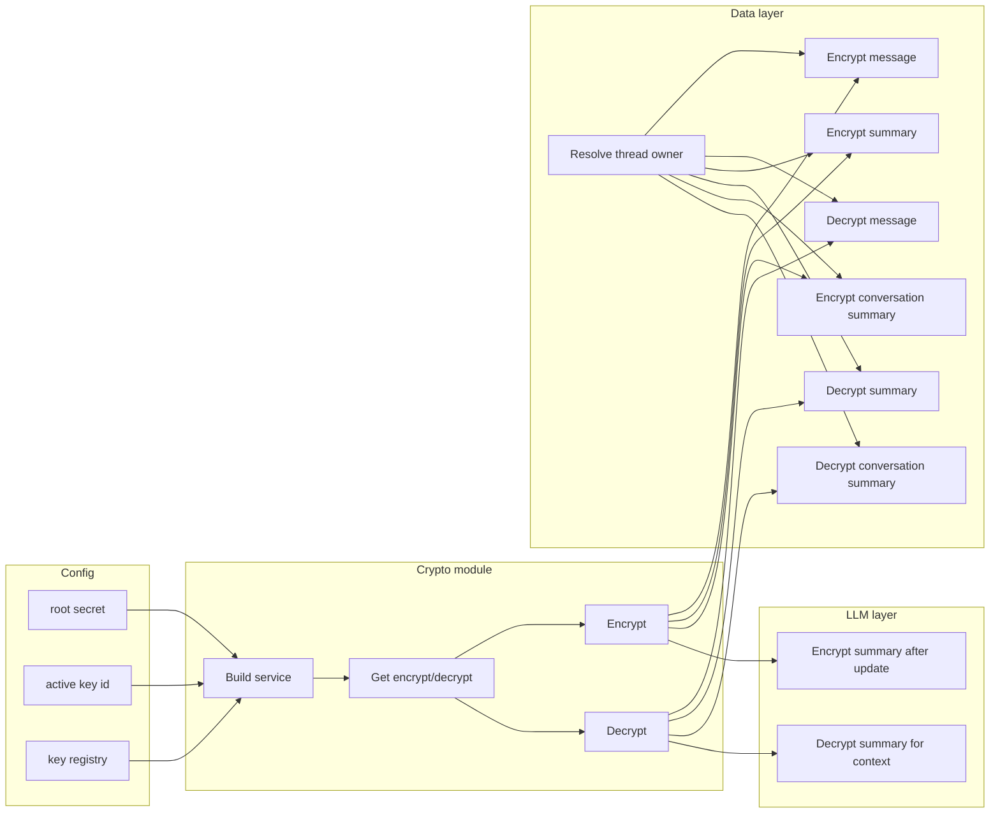

## Implemented solution

### What is encrypted

| What | When |
|------|------|
| Message content | Encrypted on insert; decrypted on read |
| Thread summary | Encrypted when writing; decrypted when building context |
| Conversation summary | Encrypted in update; decrypted when reading |

**Not encrypted:** Primary keys, timestamps, role, thread titles, short excerpts, etc.

### Server-only

The crypto module is server-only and is never imported by client code.

### Key derivation and AAD

- **Root secret:** Key derivation and AAD use a **root secret** (supplied at deploy time). Optional: an **active key id** and a **key registry** for rotation or multiple keys.
- **Per-user key:** HKDF-SHA256 derives a 32-byte key per user from the root secret (with salt and a fixed info string). No per-user keys are stored.
- **AAD:** Ciphertext is bound to user id, thread id, and field name so it cannot be reused in another context.

### Payload format and legacy

- **Encrypted value:** `enc:v1:<keyId>:<ivBase64>:<tagBase64>:<ciphertextBase64>`
- **Legacy:** Values not starting with `enc:` are returned as plaintext.

### Where it runs

- **Crypto module:** Encrypt/decrypt API and key derivation; server-only.
- **Data layer:** Encrypt/decrypt messages and both summary fields; resolves thread owner first.
- **LLM layer:** Decrypt/encrypt summary text when building or updating context.

How the layers fit together:



---

## Final architecture and security properties

End-to-end pipeline:

```
User
 │
TLS 1.3
 │
Next.js server
 │
HKDF-derived user encryption keys
 │
AES-256-GCM field encryption
 │
Supabase (AES-256 at rest)
 │
disk
```

**Ciphertext format:** A versioned prefix, key id, then IV, tag, and ciphertext (e.g. `enc:v1:<keyId>:<iv>:<tag>:<ciphertext>`).

**Encrypted fields:** Message content, thread summary, conversation summary.

### Security properties achieved

- **Database compromise:** Attackers see ciphertext only.
- **Row swapping / tampering:** Detected by AEAD authentication tag.
- **Partial compromise:** User-scoped keys reduce blast radius.
- **Operational rollout:** Mixed plaintext/encrypted rows supported.

### Why this fits Organic LLM

Organic LLM stores personal conversations, long-term AI memory, research notes, and summaries. This architecture protects those while still allowing AI reasoning, efficient queries, and gradual system evolution.
