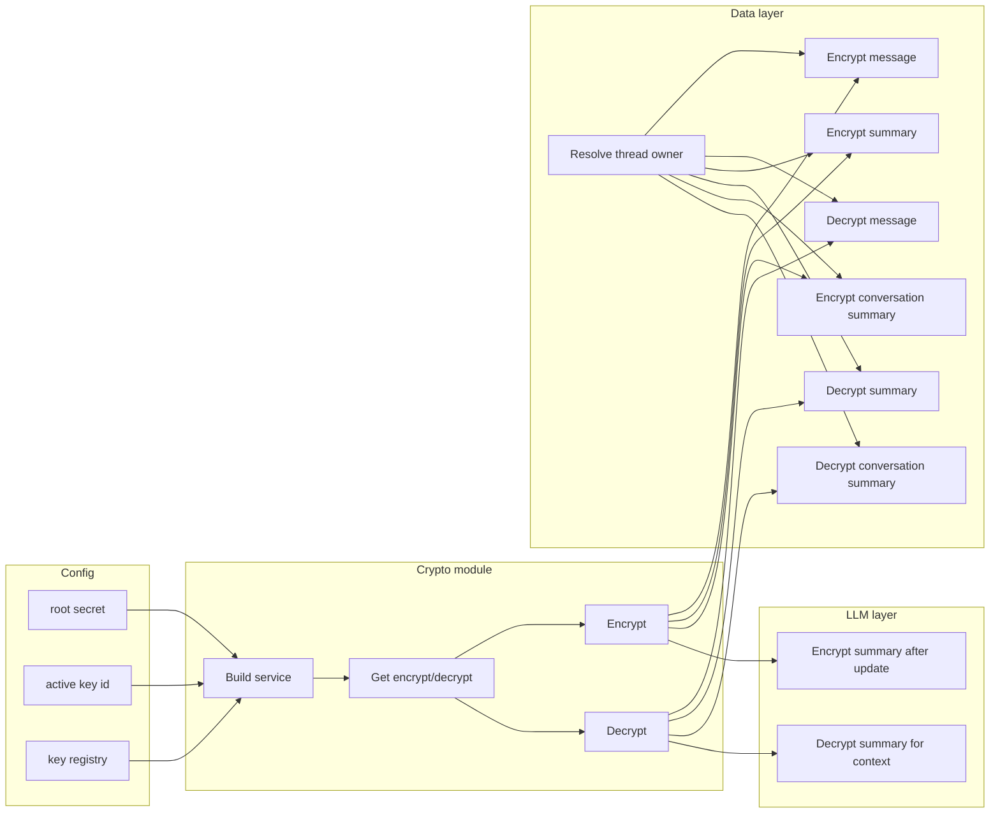

# Memory Encryption

Organic LLM encrypts sensitive chat and summary data at rest. This page explains the problem we solved, the research and options we weighed, and the architecture we implemented.

## Problem statement

Conversations and AI-generated summaries are high-sensitivity data. Storing them in plaintext in a database exposes users to risk if the database is compromised, leaked, or accessed by admins. We wanted application-layer encryption so that even with database access, attackers see only ciphertext. The solution had to fit our Next.js and Supabase stack, avoid risky migrations, and stay compatible with future key rotation or KMS.

## Research

We investigated how to design a practical, production-ready encryption layer for Organic LLM.

### Goal of the research

The goal was to protect stored AI conversation data and summaries while integrating cleanly with the existing stack, avoiding high-risk migrations, and remaining compatible with future improvements like KMS and key rotation.

### Survey of security practices in major AI applications

We looked at how leading AI systems secure chat data: ChatGPT, Claude, Gemini, Cursor, Notion AI, Perplexity.

| Layer                | Typical technology   |
|----------------------|----------------------|
| Transport encryption | TLS 1.2 / TLS 1.3    |
| Storage encryption   | AES-256              |
| Key management       | KMS / HSM            |

Most rely on transport and disk encryption but **rarely use application-layer encryption**—so plaintext prompts are often stored in databases. That gap meant application-layer encryption would significantly strengthen Organic LLM.

### Encryption model evaluation

**Database-only encryption**
Protects physical disk.  
Does not protect against database compromise or admin access.
**Insufficient.**

**Application-layer encryption**
Encrypt before writing to the DB.  
Protects against DB leaks.  
Common in privacy-focused apps; adds moderate complexity.
**Best approach.**

### Encryption algorithm research

- **AES-256-GCM:** Hardware-accelerated, built into Node.js, authenticated encryption (AEAD), widely audited. Requires careful IV handling. **Chosen** for Node, built-in primitives, fewer dependencies.
- **XChaCha20-Poly1305:** Forgiving nonce model, excellent design. Requires external library; slower on systems with AES acceleration. Good alternative but unnecessary for this rollout.

### Key management research

- **Single global key:** One compromise exposes all users. **Rejected.**
- **HKDF-derived per-user keys:** Root secret → HKDF → user key. Isolates user data, no extra key storage. Root compromise still affects all. **Chosen** for near-term.
- **Per-user stored DEKs (KMS):** Strong isolation. Requires key storage and KMS. **Future improvement.**

### Data sensitivity analysis

**Sensitive:** Message content and thread summaries (raw conversations, summaries, insights).

**Non-sensitive:** Short excerpts, thread titles, timestamps, IDs.

**Conclusion:** Field-level encryption.

### Safe deployment strategy

- **Full migration:** Encrypt all rows at once. Downtime and risk. **Rejected.**
- **Mixed-mode:** Rows may be plaintext or `enc:v1:` ciphertext. Decrypt when prefix present; otherwise treat as plaintext. Zero downtime, gradual rollout. **Chosen.**

### Ciphertext versioning

Self-describing format: a versioned prefix, key id, then IV, tag, and ciphertext. Supports algorithm upgrades, key rotation, and mixed data.

### Logging and operational security

Real-world incidents show logs often leak prompts and conversations. We log only metadata (message ID, token counts, model, timings) and never plaintext.

### Integrity protection

AES-GCM provides ciphertext authentication. We also use AAD (additional authenticated data) to bind `user_id`, `thread_id`, and `field_name` so ciphertext cannot be copied between records.

### Outcome

The design provides protection against database compromise, authenticated integrity, user-scoped key compartmentalization, safe rollout without migration risk, and compatibility with future key rotation and KMS—while staying simple enough to implement in the current stack.

*Research accelerated with ChatGPT Atlas.*

---

## Design space (options we weighed)

### 1. Encryption scope

| Option | Pros | Cons | Verdict |
|--------|------|------|---------|
| A — Encrypt entire database | Simplest; no app changes | DB compromise exposes all; admins/backups see plaintext | Rejected |
| B — Encrypt entire rows/tables | Stronger than DB-only | Breaks queryability; harder migrations | Not necessary |
| **C — Field-level** | Protects high-value content; metadata searchable; minimal schema disruption | Slightly more app logic | **Chosen** |

### 2. Encryption algorithm

| Option | Pros | Cons | Verdict |
|--------|------|------|---------|
| **A — AES-256-GCM** | Hardware-accelerated; Node built-in; AEAD; widely audited | Careful IV handling | **Chosen** |
| B — XChaCha20-Poly1305 | Safe nonce model; IV misuse resistant | Needs libsodium; slower on AES-NI | Good alternative |

### 3. Key architecture

| Option | Pros | Cons | Verdict |
|--------|------|------|---------|
| A — Single global key | Simplest | One compromise = entire DB | Too risky |
| **B — HKDF-derived user keys** | Compartmentalizes users; no extra key storage | Root compromise affects all | **Chosen** |
| C — Per-user stored DEKs | Stronger isolation | Key storage; KMS; ops | Future improvement |

### 4. Key management

| Option | Pros | Cons | Verdict |
|--------|------|------|---------|
| **A — Env variable** | Simple; deployable now | Server compromise exposes root | **Chosen for now** |
| B — Cloud KMS | Hardware-backed; rotation; audit | Infra; cost | Future step |

### 5. Ciphertext format

| Option | Pros | Cons | Verdict |
|--------|------|------|---------|
| A — Raw (iv+tag+ciphertext) | Minimal storage | No versioning; brittle | Too fragile |
| **B — Versioned payload** | Key rotation; algorithm upgrades; mixed rollout | Slightly larger | **Chosen** |

### 6. Rollout strategy

| Option | Pros | Cons | Verdict |
|--------|------|------|---------|
| A — Full DB migration | Clean state | Risk; downtime | Rejected |
| **B — Mixed-mode** | Zero downtime; gradual | Temporary mixed rows | **Chosen** |

### 7. Encryption location

| Option | Pros | Cons | Verdict |
|--------|------|------|---------|
| A — Client-side | Strongest privacy | LLM cannot process encrypted text | Impossible for AI chat |
| **B — Server-side** | Protects DB compromise; LLM can read in server memory | Server must be trusted | **Chosen** |

### 8. Logging security

Log only metadata (message ID, thread ID, token counts, model, timings). Never log plaintext prompts.

### 9. AAD (additional authenticated data)

Bind `user_id`, `thread_id`, `field_name` to ciphertext (AES-GCM AAD). Prevents ciphertext swapping. Implemented in code.

---

## Implemented solution

### What is encrypted

| What | When |
|------|------|
| Message content | Encrypted on insert; decrypted on read |
| Thread summary | Encrypted when writing; decrypted when building context |
| Conversation summary | Encrypted in update; decrypted when reading |

**Not encrypted:** Primary keys, timestamps, role, thread titles, short excerpts, etc.

### Server-only

The crypto module is server-only and is never imported by client code.

### Key derivation and AAD

- **Root secret:** Key derivation and AAD use a root secret (supplied at deploy time). Optional: active key id and key registry for rotation or multiple keys.
- **Per-user key:** HKDF-SHA256 derives a 32-byte key per user from the root secret (with salt and a fixed info string). No per-user keys are stored.
- **AAD:** Ciphertext is bound to user id, thread id, and field name so it cannot be reused in another context.

### Payload format and legacy

- **Encrypted value:** `enc:v1:<keyId>:<ivBase64>:<tagBase64>:<ciphertextBase64>`
- **Legacy:** Values not starting with `enc:` are returned as plaintext.

### Where it runs

- **Crypto module:** Encrypt/decrypt API and key derivation; server-only.
- **Data layer:** Encrypt/decrypt messages and both summary fields; resolves thread owner first.
- **LLM layer:** Decrypt/encrypt summary text when building or updating context.

How the layers fit together:



---

## Final architecture and security properties

End-to-end pipeline:

```
User
 │
TLS 1.3
 │
Next.js server
 │
HKDF-derived user encryption keys
 │
AES-256-GCM field encryption
 │
Supabase (AES-256 at rest)
 │
disk
```

**Ciphertext format:** A versioned prefix, key id, then IV, tag, and ciphertext (e.g. `enc:v1:<keyId>:<iv>:<tag>:<ciphertext>`).

**Encrypted fields:** Message content, thread summary, conversation summary.

### Security properties achieved

- **Database compromise:** Attackers see ciphertext only.
- **Row swapping / tampering:** Detected by AEAD authentication tag.
- **Partial compromise:** User-scoped keys reduce blast radius.
- **Operational rollout:** Mixed plaintext/encrypted rows supported.

### Why this fits Organic LLM

Organic LLM stores personal conversations, long-term AI memory, research notes, and summaries. This architecture protects those while still allowing AI reasoning, efficient queries, and gradual system evolution.
