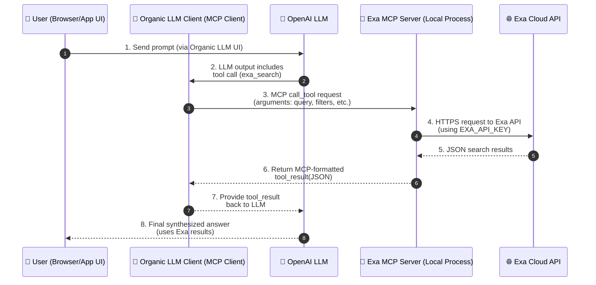

```mermaid
sequenceDiagram
    autonumber

    participant User as 🧑 User (Browser/App UI)
    participant OLLM as 🌱 Organic LLM Client (MCP Client)
    participant GPT as 🤖 OpenAI LLM
    participant MCP as 🔧 Exa MCP Server (Local Process)
    participant Exa as 🌐 Exa Cloud API

    User->>GPT: 1. Send prompt (via Organic LLM UI)
    GPT->>OLLM: 2. LLM output includes<br/>tool call (exa_search)
    OLLM->>MCP: 3. MCP call_tool request<br/>(arguments: query, filters, etc.)

    MCP->>Exa: 4. HTTPS request to Exa API<br/>(using EXA_API_KEY)
    Exa-->>MCP: 5. JSON search results

    MCP-->>OLLM: 6. Return MCP-formatted<br/>tool_result(JSON)
    OLLM-->>GPT: 7. Provide tool_result<br/>back to LLM

    GPT-->>User: 8. Final synthesized answer<br/>(uses Exa results)
```
