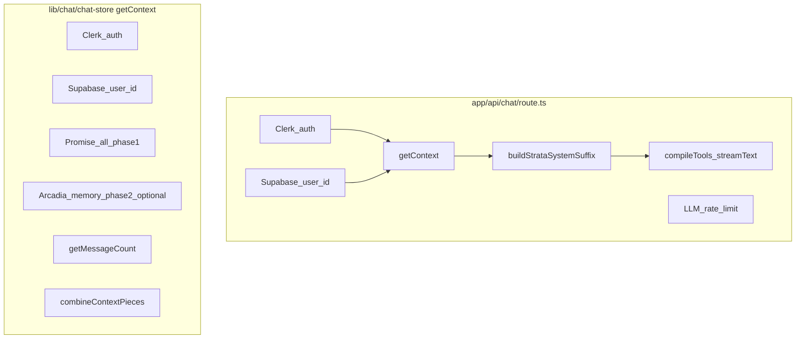

# Context building architecture

Internal reference for how chat context is assembled before `streamText`, what it depends on, where latency comes from, and where to optimize.

**Primary implementation:** [`lib/chat/chat-store.ts`](../../lib/chat/chat-store.ts) — `getContext`  
**Primary consumer:** [`app/api/chat/route.ts`](../../app/api/chat/route.ts) — `POST` handler (after auth / rate limits, before `compileTools` / `streamText`)

Related: [`lib/memory/README.md`](../../lib/memory/README.md) (Mem0 boundary), [`lib/memory/query-rewriter.ts`](../../lib/memory/query-rewriter.ts) (Arcadia + tool query rewrite).

---

## High-level flow

Notes:

- `getContext` performs its **own** `auth()` + `getSupabaseUserId` (duplicate identity work relative to the route, which already resolved `sbUserId`). Both are network-bound when sessions hit origin services.
- Strata experiences add **another** async step after `getContext`: `buildStrataSystemSuffix` may call `getStrataPageById` (Supabase + decryption) for `strata_page`.

---

## `getContext` dependency graph

### Step 0 — Identity (sequential, before parallel work)

| Step | Function / API | Network? | Typical bottleneck |
|------|----------------|----------|----------------------|
| 0a | `auth()` (Clerk) | Yes — Clerk session / JWT | Low–medium (edge-cached); adds ~5–50 ms when cold |
| 0b | `getSupabaseUserId(clerkUserId)` | Yes — Supabase profile read | Low–medium; ~10–80 ms |

Failure here aborts context; route may still have `sbUserId` from earlier but `getContext` does not reuse it today.

### Step 4 — System prompt (local)

- Chooses `SYSTEM_PROMPT` / Prometheus / Spark string, injects `{{currentDateTime}}`.
- **CPU:** `estimateTokenCount` via tiktoken-style encode ([`lib/llm/chat-helpers.ts`](../../lib/llm/chat-helpers.ts)) — sub-millisecond for normal prompt sizes.

### Phase 1 — `Promise.all` (parallel)

Started together after Step 4 token estimate:

| Branch | Source | Network? | Notes |
|--------|--------|----------|--------|
| Messages | `getNMessages(chatId, limit)` | Yes — Supabase | Default limit 10 (30 for Strata experiences). Returns recent thread messages **excluding** the current request message in the usual path; route merges `[...messages, incomingMessage]`. |
| Summary | `getConversationSummary(chatId)` | Yes — Supabase | Encrypted summary row; decrypt on read path in chat layer. |
| Memory (non-Arcadia only) | `searchMemoriesForUser` | Yes — Upstash rate limit + Mem0 | Limit 5. Rate limit: [`lib/rate-limit/memory.ts`](../../lib/rate-limit/memory.ts) (Redis). |
| Memory (Arcadia) | Resolved in phase 2 | — | Placeholder promise returns `{ results: [] }` in parallel slot; real work deferred. |
| Persisted schemas | `getPersistedSchemas(chatId)` when Strata-like | Yes — Supabase | Only when `persistedSchemasEnabled`. |

**Bottleneck:** slowest of the four wins. Often **Supabase round-trip** or **Mem0** for main chat with memory.

### Phase 2 — Arcadia memory only (`memoryEnabled && experience === "arcadia"`)

Runs **after** phase 1 so recent messages exist for query rewriting.

| Step | What | Network? | Est. / notes |
|------|------|----------|----------------|
| 2a | `rewriteMemoryQuery` | **Yes** — AI Gateway `generateText` (default `openai/gpt-5.4-nano`) | Hard cap **800 ms**; heuristic skip avoids call. Typical **50–400 ms** when invoked. |
| 2b | `searchMemoriesWithL1Cache` × N queries | **Yes** per miss — Upstash + Mem0; **no** Mem0 on L1 hit | N = 1–3 rewritten queries, **parallel** `Promise.all`. Each miss: embedding + vector search + JSON (often **40–250+ ms** each, region-dependent). |
| 2c | `mergeMemorySearchResultsByMaxScore` | No | Pure CPU, negligible. |

Observability: structured log `getContext` / `"Arcadia memory pipeline"` with `rewriteMs`, `perQuery[]` (`cacheHit`, `searchMs`), `mergedCount`.

### Step 5e — Message count (sequential, after memories)

| Step | Function | Network? |
|------|----------|----------|
| 5e | `getMessageCount(chatId)` | Yes — Supabase |

Used only for the “Current chat” context blurb (total vs in-window). Adds another round-trip **after** the big parallel batch.

### Finally block

- Logs **total** `getContext` wall time and per-piece token estimates ([`chat-store.ts`](../../lib/chat/chat-store.ts) `finally` ~L942–954).
- Does **not** yet split sub-phase timings (messages vs summary vs memory) in one line; use Arcadia pipeline log + Supabase tracing for deeper splits.

---

## Post–`getContext` in `/api/chat` (still “context” for the model)

| Step | What | Network? |
|------|------|----------|
| Strata suffix | `buildStrataSystemSuffix` → optional `fetchPage(strataPageId)` | Yes for `strata_page` with page id (Supabase + crypto) |
| Tools | `compileTools` — memory / web / history / Strata / Mermaid | Tool **execution** is later; compilation is local. `search_memories` runs Mem0 with the model’s tool `query` verbatim (no rewrite). **Query rewrite** applies only inside Arcadia `getContext` for the initial memory pull; the user’s last `UIMessage` is never replaced by rewritten text. |

---

## Network inventory (quick reference)

| Dependency | When | Failure mode |
|------------|------|----------------|
| Clerk `auth()` | Route + `getContext` | 401 / empty context |
| Supabase `getSupabaseUserId` | Route + `getContext` | 404 user |
| Supabase `getNMessages`, `getConversationSummary`, `getPersistedSchemas`, `getMessageCount` | `getContext` | Partial empty strings / skipped blocks |
| Upstash Redis (`checkMemorySearchLimit`, etc.) | Before each Mem0 search | Rate-limit error → no memories |
| Mem0 (`storeSearchMemories`) | Memory search path | Throws → caught → empty results in some callers |
| AI Gateway `generateText` | Arcadia/tool query rewrite | Timeout → fallback to raw query |
| In-process L1 cache | `searchMemoriesWithL1Cache` | Encrypt/decrypt local CPU; no network on hit |

---

## Bottlenecks (typical ordering)

1. **Mem0 vector search** (cold) — dominant for memory-enabled paths; highly variable by region and payload size.
2. **Supabase** — multiple sequential queries (`getMessageCount` after phase 1; duplicate auth path in `getContext`).
3. **Query rewrite LLM** (Arcadia + tool) — capped at 800 ms; skipped by heuristics when possible.
4. **Upstash** — usually small vs Mem0; can spike on Redis cold start.
5. **Clerk** — usually small after warm session.

---

## Speedups already in place

| Mechanism | Where | Effect |
|-----------|--------|--------|
| **Parallel phase 1** | `Promise.all` messages + summary + non-Arcadia memory + persisted | Hides independent latency behind the slowest branch. |
| **Parallel multi-query Mem0** | Arcadia + `search_memories` after rewrite | N searches overlap instead of summing serially. |
| **L1 encrypted cache** | [`lib/memory/memory-search-cache.ts`](../../lib/memory/memory-search-cache.ts) | Key = user + normalized query + limit; **cache hit** avoids Mem0 (sub-ms decrypt + parse vs tens–hundreds of ms). |
| **Rewrite short-circuit** | [`lib/memory/query-rewriter.ts`](../../lib/memory/query-rewriter.ts) | Skips LLM when query is trivial, already explicit, or insufficient conversation depth. |
| **Feature flag** | `ARCADIA_QUERY_REWRITE_ENABLED` | Disable rewrite entirely (`false` / `0` / `off`) to save LLM round-trip. |

---

## Speedups to consider (not implemented here)

- **Reuse `sbUserId` in `getContext`** — avoid second `getSupabaseUserId` if route passes owner id (requires API change / trust boundary review).
- **Overlap `getMessageCount` with phase 1** — today it runs after merge; could start in `Promise.all` if the blurb can tolerate slightly stale count.
- **Strata `getContext` limit 30** — larger payloads increase Supabase + token estimate time; tune per product need.
- **Cross-request cache** for summaries — higher complexity; today only memory search has L1.

---

## Metrics: where to look today

| Signal | Location |
|--------|----------|
| Total `getContext` ms + token breakdown | Server logs: `getContext` / `Context compilation time:` ([`chat-store.ts`](../../lib/chat/chat-store.ts) `finally`) |
| Arcadia memory rewrite + per-query Mem0 | `getContext` / `"Arcadia memory pipeline"` |
| Tool memory search | `createMemorySearchTool` / `memory_search_ok` or `memory_search_error` ([`lib/llm/llm-tool-kit.ts`](../../lib/llm/llm-tool-kit.ts)) |
| Route-level context failure | `POST` / `Error getting chat context` |

**Estimated ranges** (order-of-magnitude; measure in your environment):

- `getContext` without memory: **~50–300 ms** (auth + Supabase ×2–4).
- `getContext` + main memory (single Mem0): add **~40–250+ ms** on cache miss.
- Arcadia + rewrite + 2× Mem0 miss: rewrite **≤800 ms** + **~2×** Mem0 latency (parallel).

Paste production/staging log lines into team notes and update this doc’s ranges when you have stable p50/p95.

---

## Experience-specific branches

| Experience | `getContext` differences |
|------------|-------------------------|
| Default / main chat | Memory: single `searchMemoriesForUser`, limit 5, parallel with messages. |
| `arcadia` + memory | Memory: rewrite → parallel `searchMemoriesWithL1Cache` → merge → tiered prompt + inventory string. |
| Strata hub / page | `limit` 30, `persistedSchemasEnabled` for page path; Strata suffix + optional full page fetch **after** `getContext` in route. |

---

## Changelog

| Date | Change |
|------|--------|
| 2026-04 | Initial internal doc for `getContext`, route wiring, network map, Arcadia memory pipeline. |
