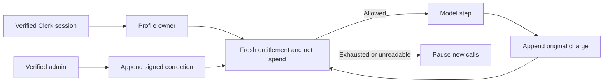

# Authorize model spend from entitlements and an append-only ledger

**Status:** Accepted\
**Date:** 2026-10-10\
**Affects:** LLM request gates, SDK step loops, usage dashboard, admin accounting

## Decision

`account_entitlements` holds plan, reset credits, and a weekly cycle anchor outside the
user-editable profile. Clerk authentication resolves the profile; request bodies and profile
email never select the plan owner. Authenticated database clients can read only their own
entitlement. Only privileged server roles can change it. The profile-insert trigger supplies
defaults for every profile creation path; migration backfill preserves existing grants.

The gate reads fresh entitlements and net ledger spend before new model requests. It returns
429 `plan_limit` for an exhausted allowance, or 503 `plan_unavailable` when authorization
data cannot be read. It never authorizes against cached spending or treats a missing ledger
as zero. Before the entitlement migration, a readable existing ledger supports the default
Monday UTC window; after migration, the adjustment-aware sum RPC is mandatory.

Per-user windows repeat every seven days from `cycle_anchor`. A reset compares the exact
database anchor confirmed by the client, including microseconds, before decrementing a credit
and moving the anchor. Concurrent submissions or retries with that version consume at most
one credit. This applies to a reset request, not a second intentionally confirmed reset.
The API refuses to consume credits while the usage check is unavailable.

## Accounting

- `llm_usage_events` preserves original model, operation, timestamp, token counts, and USD
  cost. Gateway-reported billed cost takes precedence over the existing price estimate.
  A billed cost with missing token details still creates a charge, with zero known tokens.
- Input, output, cached input, and reasoning counts retain the provider's definitions.
  Cached input is a subset of input; reasoning is a breakdown of output. Counts are not
  inferred from elapsed time or USD charges. Unknown cache prices use the input estimate
  rather than treating cached input as free.
- `llm_usage_adjustments` records signed USD corrections with an immutable entry ID,
  reason, actor, creation time, and effective time. Original charges remain unchanged;
  correcting a correction requires another entry. Token details on original charges remain
  historical observations; the correction changes cost used by the allowance.
- A correction linked to a charge applies to that charge's original window. The database
  verifies owner membership and derives effective time; a general credit/debit applies now.
  Net spend is charges plus adjustments, floored at zero for allowance calculations.
- Users cannot insert, update, delete, or truncate either ledger. Server roles can append.
  Mutation triggers also reject ordinary privileged UPDATE, DELETE, and TRUNCATE statements.
  Removing a profile preserves accounting entries. Database owners still control schema DDL.
- Admin APIs recheck `requireAdmin()` per request. The adjustment RPC separately verifies the
  server-derived actor's admin membership and charge ownership. A UUID is an idempotency key,
  never an authorization credential; a replay succeeds only for identical submitted data.
  Adjustment diagnostics log IDs and outcomes, never the reason or attachment/message text.

SDK hooks await each step's ledger write before the next budget check. SDK 7 notification
callbacks swallow thrown errors, so the hooks retain a write failure and throw from
`prepareStep` before another model step. Structured generation also receives an initial
check because `generateObject` has no `prepareStep`. Existing aggregate metrics remain but
their duplicate best-effort ledger inserts are disabled on instrumented paths.

## Operations

Apply [account_entitlements.sql](../../migrations/account_entitlements.sql) as postgres after
the existing profile, admin-access, and usage-event migrations. It is rerunnable and does not
reset existing balances. Deploy code that understands the new reset RPC and weekly windows
together; older one-argument reset clients cannot consume credits.

Use `bun run plan:set --email <verified-email> --plan pro --resets 25` to preview a grant,
then add `--yes` to apply it. The script requires server credentials and exactly one verified
Clerk account. Never use the editable `profiles.email` to authorize a grant. Plan cap values
are configured in `lib/usage/plans.ts`; product decisions belong in the private billing canon.

Open `/admin/usage` to review an account by internal profile ID and append corrections.
`GET /api/admin/usage-ledger?ownerId=<uuid>&offset=0` returns up to 100 charges and 100
adjustments. `POST` accepts `{ id, ownerId, eventId?, deltaUsd, reason }`; it accepts no actor
or effective date from the client. Use a new ID for a new correction and the same ID for a
retry. The Usage panel shows net allowance spend, reset countdown, and credits. Its tracked
call charts preserve original charge totals, so they can differ from corrected net spend.

## Limits and validation

This is a gate against **recorded** spend, not a reservation system. Concurrent requests and
already-running calls can exceed the remaining allowance before usage is recorded. A failed
final-step write is logged, but SDK notification handling cannot turn it into a durable
accounting entry; durable reconciliation/outbox handling is not implemented. Provider calls
that fail without returning usage cannot be reconstructed from this ledger alone. Pricing
fallbacks are estimates, including unknown models; provider billing remains authoritative.
Dashboard charts cap reads at 20,000 events; the database budget sum and paginated admin
ledger do not use that display cap.

Realtime voice records token cost when available and the existing elapsed-time estimate
otherwise. It checks the plan at start, heartbeat, and tool requests. Direct WebRTC sessions
rely on a cooperating client to end an existing call; this is not a server-controlled billing
cutoff. Standalone speech synthesis and vendor-managed memory/embedding charges do not yet
have complete provider-cost ingestion. App-wide publishing jobs are not charged to a user's
plan. Strict zero-overshoot enforcement requires reservations and provider-side enforcement
or a controlled voice transport.

Unit tests cover budgets, malformed spend, reset authorization, admin authorization, money
validation, cache estimates, UI confirmation, duplicate clicks, and missing token details.
`llm-budget-sdk.test.ts` exercises the actual SDK tool loop and structured generation.
The opt-in PostgreSQL test executes the migration twice in an isolated schema and rolls back;
it verifies immutable entries, self-only reads, denied client writes, correction scope,
idempotency, reset compare-and-set, and retention after profile deletion. Set
`USAGE_LEDGER_TEST_DATABASE_URL` explicitly and run through `bun run test:integration`.
