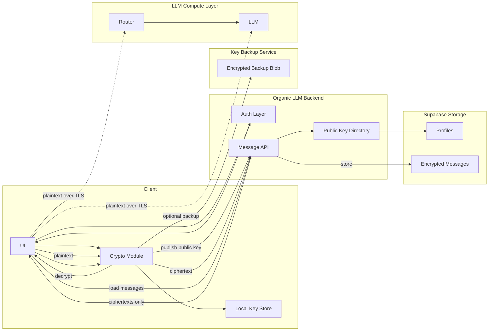

# E2EE



## Prototype

```typescript
// --- End-to-End Encryption Minimal Prototype (<100 lines) ---

// --- Demo ---
(async () => {
  // Alice + Bob generate key pairs
  const alice = await generateKeyPair();
  const bob = await generateKeyPair();

  // Exchange *public keys only*
  const alicePub = await exportPublicKey(alice.publicKey);
  const bobPub = await exportPublicKey(bob.publicKey);

  // Derive shared AES key on both sides
  const aliceAES = await deriveAESKey(alice.privateKey, bobPub);
  const bobAES = await deriveAESKey(bob.privateKey, alicePub);

  // Encrypt using Alice's AES key
  const { ciphertext, iv } = await encrypt(aliceAES, "hello from alice");

  // Decrypt using Bob's AES key
  const msg = await decrypt(bobAES, ciphertext, iv);
  console.log("Decrypted:", msg); // → "hello from alice"
})();

// Generate a P-256 ECDH key pair
async function generateKeyPair() {
  return crypto.subtle.generateKey(
    { name: "ECDH", namedCurve: "P-256" },
    true,
    ["deriveKey"]
  );
}

// Export public key for sharing
async function exportPublicKey(key) {
  return crypto.subtle.exportKey("raw", key);
}

// Derive a shared AES key using ECDH
async function deriveAESKey(privateKey, theirPublicKeyRaw) {
  const theirPublicKey = await crypto.subtle.importKey(
    "raw",
    theirPublicKeyRaw,
    { name: "ECDH", namedCurve: "P-256" },
    true,
    []
  );

  return crypto.subtle.deriveKey(
    { name: "ECDH", public: theirPublicKey },
    privateKey,
    { name: "AES-GCM", length: 256 },
    false,
    ["encrypt", "decrypt"]
  );
}

// Encrypt a UTF-8 string
async function encrypt(aesKey, plaintext) {
  const enc = new TextEncoder().encode(plaintext);
  const iv = crypto.getRandomValues(new Uint8Array(12));

  const ciphertext = await crypto.subtle.encrypt(
    { name: "AES-GCM", iv },
    aesKey,
    enc
  );

  return { ciphertext: new Uint8Array(ciphertext), iv };
}

// Decrypt cipher → UTF-8 string
async function decrypt(aesKey, ciphertext, iv) {
  const plaintext = await crypto.subtle.decrypt(
    { name: "AES-GCM", iv },
    aesKey,
    ciphertext
  );
  return new TextDecoder().decode(plaintext);
}
```

## Exactly Where Encryption Wraps Your Fetch Calls

```typescript
// encryptFetch.js (client-side)

export async function encryptFetch(url, plaintextObj) {
  // 1. Serialize to JSON
  const plaintext = JSON.stringify(plaintextObj);

  // 2. Encrypt locally before sending
  const { ciphertext, iv } = await window.cryptoEngine.encrypt(plaintext);

  // 3. Send only ciphertext to your API
  return fetch(url, {
    method: "POST",
    headers: { "Content-Type": "application/json" },
    body: JSON.stringify({
      ciphertext: Array.from(ciphertext), // serialize bytes
      iv: Array.from(iv),
    }),
  });
}

// Usage (client)
await encryptFetch("/api/messages/send", {
  message: "This is a secret",
  timestamp: Date.now()
});


// API route recieves:
{
  "ciphertext": [...],
  "iv": [...]
}
```

## Middleware Rules to Ensure You Never Accidentally Accept Plaintext

```typescript
// middleware.ts
import { NextResponse } from "next/server";

export function middleware(req) {
  const body = req.body || {};
  const url = req.nextUrl.pathname;

  // apply only to message endpoints if desired
  if (url.startsWith("/api/messages")) {
    const forbiddenKeys = ["message", "text", "content", "prompt", "body"];

    const hasPlaintext = forbiddenKeys.some((k) => k in body);
    if (hasPlaintext) {
      return new NextResponse(
        JSON.stringify({
          error:
            "Plaintext detected. All data must be encrypted on the client.",
        }),
        { status: 400 }
      );
    }
  }

  return NextResponse.next();
}


// Enforce ciphertext-only payloads

if (url.startsWith("/api/messages")) {
  if (!("ciphertext" in body) || !("iv" in body)) {
    return new NextResponse("Missing ciphertext or iv", { status: 400 });
  }
}


// Enforce no accidental decryption server-sid
// /api/messages/send
export const config = {
  runtime: "edge",   // no Node 'crypto' → prevents server-side decryption
};


// Enforce that servers see only opaque metadata

{
  "ciphertext": [...],
  "iv": [...],
  "sender_id": "...",
  "timestamp": 12345
}

```
