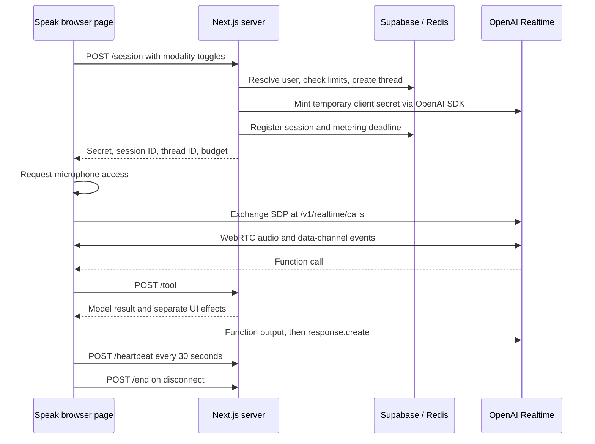

# Speak Realtime — current setup

> **Superseded in part on 2026-09-17.** Persistence, resume, memory, and usage forwarding
> changed; see [`decisions/20260917-voice-continuity-and-memory.md`](./decisions/20260917-voice-continuity-and-memory.md)
> and the [README](./README.md). The transport, limits, and accounting sections below still
> describe the current code.

Investigated **2026-09-12**, against the local working tree based on `fd20262`.
This is a description of the implementation, including local changes present during the
review. It does not establish what is deployed. Sources below link to the owning code.

Speak Live connects the browser microphone directly to OpenAI over WebRTC. The app server
authenticates the user, creates a chat thread, mints a temporary credential, executes tools,
and meters usage. The page has captions and optional visual outputs, but voice conversations
are not saved to chat or supplied with the user's memory or previous conversations.

The investigation used source inspection, the installed OpenAI SDK, official API documentation,
and repository checks. No authenticated microphone session or production configuration was
tested. Findings about visible behavior below follow from code; they are not live-call results.

## Page and controls

[`/speak`](../../app/speak/page.tsx) renders
[`SpeakShell`](../../app/speak/_components/SpeakShell.tsx), which defaults to
[`LiveVoiceStage`](../../app/speak/_components/LiveVoiceStage.tsx).

| Element | Current behavior |
|---------|------------------|
| Background and orb | Full-bleed liquid-chrome background and an animated presence orb. The orb responds to session events, not microphone volume. |
| Microphone button | Starts a session; shows a spinner while connecting; becomes an End button when connected. |
| Reset | Disconnects and clears transcript, errors, budget display, tool caption, cards, web preview, and UI snapshots. It does not start another session. |
| Text toggle | On by default. Shows the main caption and an in-memory transcript list. |
| GenUI toggle | Off by default. Enables structured-card tools and the visual panel. |
| Web toggle | Off by default. Enables a page-preview tool and the visual panel. |
| Modality changes | Disabled while connecting or connected. End the session to change them. Preferences live in component state. |
| Budget chip | Initially says “awaiting session”; then shows remaining spend, daily minute units, and the session maximum. |
| Read text aloud instead | Switches to a separate TTS mode, unmounting Live and invoking its connection cleanup. |

The visual panel appears as soon as GenUI or Web is enabled, including before a tool runs.
It sits beside the voice stage on large screens and below it on smaller screens, where its
height is capped at `45vh`. There is no Live control for mute, microphone selection, voice
selection, typed input, transcript export, or resuming an existing conversation.

## Connection and session flow

The server uses the `openai` Node SDK only to mint the credential. The browser transport and
event handling are custom code in [`useRealtimeVoice`](../../hooks/use-realtime-voice.ts);
the active path does not use the OpenAI Agents SDK or the chat streaming pipeline.
See the existing [session-mint decision](./decisions/20260813-openai-sdk-session-mint.md).

The [session route](../../app/api/ai/speak/realtime/session/route.ts) requires Clerk
authentication and a corresponding Supabase user. It checks the general LLM message limit
and Speak budget/concurrency limits before minting. Thread creation is attempted before the
OpenAI request; failure to create a thread is logged but does not prevent voice startup.

The hook requests microphone access **after** the server session is registered. Once the SDP
answer is applied, it marks the session connected and starts the heartbeat. Remote audio plays
through a hidden autoplay audio element. The `oai-events` data channel carries JSON events.

End closes the data channel and peer connection, stops microphone tracks, clears the audio
source, and sends a best-effort `/end` request. End preserves transcript and visual content on
the mounted page. Starting again creates a new server session and thread without clearing that
old content; Reset is the explicit clearing action.

## Model, prompt, and configuration

These are **code defaults**, not verified environment overrides or provider availability.
The mint configuration lives in the [session route](../../app/api/ai/speak/realtime/session/route.ts);
environment getters live in the [Realtime limiter](../../lib/rate-limit/speak-realtime.ts).

| Setting | Current value / default |
|---------|-------------------------|
| Enabled | Unless `SPEAK_REALTIME_ENABLED` is exactly `false` |
| Model | `SPEAK_REALTIME_MODEL`, falling back to `gpt-realtime-2.1-mini` |
| Output voice | `alloy`, fixed in the route |
| Input transcription | `gpt-transcribe`, fixed in the route |
| Turn detection | `server_vad`; no explicit threshold, silence duration, or interruption override |
| Output token limit | `800` per response |
| Tool choice | `auto` with the compiled tools |
| Temporary credential expiry | `600` seconds after creation; separate from the app's session deadline |
| Speak spend cap | `SPEAK_MONTHLY_COST_CAP_USD`, default `20` |
| Daily minute cap | `SPEAK_DAILY_MINUTES_CAP`, default `30` |
| Session maximum | `SPEAK_SESSION_MAX_MINUTES`, default `8` minutes |
| Concurrent sessions | `SPEAK_CONCURRENT_SESSIONS`, default `1` per user |

[`buildSpeakRealtimeInstructions`](../../lib/system-prompt/speak-realtime.ts) is the entire
session instruction source. It asks for warm, concise, voice-first replies, short natural
prose without spoken markdown, and optional visuals according to the toggles. It describes
the available tools. It does not invoke chat's context builder or inject memory, profile
context, previous messages, or a thread summary.

Live requires `OPENAI_API_KEY`, Clerk/Supabase configuration, and Upstash Redis
(`UPSTASH_REDIS_REST_URL` and `UPSTASH_REDIS_REST_TOKEN`). Usage-ledger access uses the Supabase
admin client. Browser microphone permission and WebRTC support are also required.
[`CONTRIBUTING.md`](../../CONTRIBUTING.md) owns general setup instructions.

The commented model example in [`.env.example`](../../.env.example) is still
`gpt-realtime-mini`; the fallback in code is `gpt-realtime-2.1-mini`.

## Tools and visual output

[`compileSpeakRealtimeTools`](../../lib/llm/compile-speak-tools.ts) exposes **seven possible
tools**, of which **three are enabled by default**. Turning Text off too leaves only the two
thread-metadata tools. The executor checks the session owner, active status, budget, modality
gate, tool name, and argument schema before executing.

| Tool | Enabled when | Actual effect |
|------|--------------|---------------|
| `update_display_text` | Text on | Sets a caption override, up to 2,000 characters. |
| `render_gen_ui` | GenUI on | Validates a shared GenUI block and adds or replaces it by instance UUID. |
| `refresh_component` | GenUI on | Increments a remount key for an existing instance; it does not itself fetch fresh data. |
| `upsert_ui_state` | GenUI on | Merges items by ID into a local surface snapshot; the panel prints the item data as JSON. |
| `show_web_preview` | Web on | Returns a URL and optional title for an iframe. It does not search, retrieve page text, or give page contents to the model. |
| `update_thread_title` | Always | Schedules `ensureChatHasTitle(threadId)` after the HTTP response. The optional hint is logged, not supplied to title generation. |
| `summarize_thread` | Always | Schedules `updateChatSummary(threadId)` after the HTTP response. It reads stored chat messages, not the voice transcript. |

The [executor](../../lib/speak/execute-speak-tool.ts) deliberately returns two payloads:
`modelResult`, sent back to OpenAI as a function output, and `clientEffects`, applied to React
state. For example, a rendered card returns an acknowledgment and instance ID to the model;
the validated block is delivered to the UI. The hook requests another model response after
each tool result. Metadata tools report whether work was scheduled, not whether it completed.

The [visual panel](../../app/speak/_components/SpeakVisualPanel.tsx) reuses chat's
[`GenUIRenderer`](../../components/chat/gen-ui/GenUIRenderer.tsx) and
[block schemas](../../lib/schemas/gen-ui/shared.ts): answer card, decision matrix, plan timeline,
audio snippet, recipe card, shopping list, and restaurant card. Rendering those formats does
not grant their associated search or data-management capabilities. Speak has no memory search,
web search, restaurant lookup, task management, or chat-history retrieval tool.

GenUI's model-facing schema accepts a generic block object; strict block validation happens
at execution. The Realtime prompt does not provide the full block schemas or examples.
New instance IDs accumulate as separate cards; reusing an ID replaces and remounts that card.
The UI shows instance UUIDs and raw surface JSON. Web URLs are validated as HTTP or HTTPS,
although the prompt/tool description asks for HTTPS.

## State, memory, and persistence

| Data | Where it lives | What survives leaving Live |
|------|----------------|--------------------------|
| Conversation within the active call | OpenAI Realtime session | The app has no restore/reconnect path to it. |
| Captions and transcript entries | Hook/component memory | Not restored after unmount or reload. |
| Cards, web URL, UI snapshots, toggles | `LiveVoiceStage` state | Not restored after unmount or reload. |
| Chat thread | Supabase `threads` | Thread row persists; Live does not write voice turns to `messages`. |
| Session metadata and metering | Redis | Records have a one-hour TTL, refreshed when saved. |
| Usage events | Supabase `llm_usage_events` | Written asynchronously; accounting caveats are below. |

The session API accepts an optional `threadId` and `createThread: false`, but the current page
always sends `createThread: true` with no existing ID. Supplying an ID would associate the
session with a thread; it would not load that thread's conversation into Realtime.

The metadata tools call [chat helpers](../../lib/llm/chat-helpers.ts) that operate on stored
messages. A fresh voice-only thread has no such messages, so scheduling a title or summary
does not capture the conversation. Speak also does not refresh the shared sidebar list after
creating a thread. See [thread/session architecture](../thread-session-architecture.md) for
the existing chat persistence contract.

## Usage limits and accounting

The browser sends its session ID to the
[heartbeat route](../../app/api/ai/speak/realtime/heartbeat/route.ts) every 30 seconds. The
server meters elapsed wall-clock time from registration, capped at the stored session
deadline. Tool execution also meters/checks usage, and
[`/end`](../../app/api/ai/speak/realtime/end/route.ts) settles the remaining interval.
This measures connected-session time, including silence and startup after registration.

Expired abandoned sessions are settled when another session-start check runs; this is not
a scheduled cleanup worker. Until the deadline, an abandoned session can occupy a concurrency
slot. Budget responses tell the browser to tear down its WebRTC connection; the server's end
handler closes the app's session record rather than issuing an OpenAI call-hangup request.

The current accounting has two material discrepancies:

- **Daily minutes round up per interval.** `recordSpeakUsage()` charges
  `Math.max(1, Math.ceil(minutesDelta))` for every positive interval. Two approximately
  30-second heartbeats therefore consume two daily minute units for roughly one elapsed
  minute. Tool checks can add further rounding. The session's `minutesUsed` remains fractional.
- **Spend is estimated, and the ledger does not preserve that estimate.** The hook does not
  extract provider token usage or send usage to the heartbeat endpoint. The limiter therefore
  estimates cost from elapsed time using [local cost helpers](../../lib/rate-limit/llm-cost.ts).
  In that path it passes zero token counts to the global cost recorder and usage-event writer.
  The [database writer](../../data/supabase/llm-usage.ts) recomputes `cost_usd` from those token
  counts, producing zero rather than the Realtime estimate. Redis/session cost and the durable
  usage ledger can consequently disagree.

The “monthly” budget combines a Redis 30-day sliding window with database usage for the billing
cycle, taking whichever used-cost value is larger. The daily limiter is a one-day sliding
window, even though the chip labels it “today.” These counters should not be read as exact
provider billing or calendar-day totals.

## Implementation gaps visible in the current code

These are findings about current behavior, not an approved implementation plan.

| Area | Evidence and consequence |
|------|--------------------------|
| Assistant transcripts | The hook listens for `response.audio_transcript.delta/done`. The installed SDK and official Realtime guide use `response.output_audio_transcript.delta/done`. Those documented events have no matching handler, so assistant captions/transcript entries are expected to be missed. |
| Incremental captions | Even the existing delta handler replaces the caption with each delta instead of accumulating a complete utterance. |
| Caption override | After `update_display_text`, `displayText` takes precedence over later captions until Reset. Later user or system caption metadata can accompany the old override text. |
| Speaking/thinking feedback | `thinking` is declared and styled but never produced by `phaseFromEvents()`. `response.created` immediately marks the assistant speaking, before actual playback; `response.done` clears it without waiting for buffered playback to finish. |
| Connection health | “Connected” is set after applying SDP, with no peer-connection state, data-channel close/error, or Realtime `error` event handler. There is no automatic reconnect or explicit timeout/cancellation for startup. |
| Tool failures | Network failures set local error text but do not send a failed function output back to the model. Normal validation failures do return a model error. |
| Budget failures during tools | The tool route sets `shouldClose` only when error text includes uppercase `Budget`. Actual limit messages commonly contain “minute limit” or “spend cap,” so the browser may remain connected until the next heartbeat. |
| Subsequent web previews | Speak changes `defaultUrl` on an existing `WebPreview`, whose internal URL is initialized with `useState(defaultUrl)` and never synchronized to that prop. A second tool-selected page can leave the iframe on the first URL. |
| Tool presentation | There is no pending-tool UI or latency-based acknowledgment mechanism. Cards accumulate across calls; there is no per-turn enforcement of one visual anchor. |
| Motion | The orb has a 1.8-second transition and continuously animated SVG shapes; the stage uses a 450 ms transition. Neither component implements its own reduced-motion branch. |

The event-name finding is checked against the
[official Realtime conversation guide](https://developers.openai.com/api/docs/guides/realtime-conversations#client-and-server-events-for-audio-in-webrtc)
and `node_modules/openai/src/resources/realtime/realtime.ts` in the installed SDK. Its visible
impact still needs an authenticated call to confirm.

The canonical [tool-behavior rules](./tool-behavior.md) and
[design backbone](../design/README.md) describe expected presentation behavior. The table above
records where implementation is incomplete without changing those rules. Existing unresolved
product direction remains in `organic-llm-hub/speak/open-questions.md`.

## Other voice paths and verification

[`ReadAloudStage`](../../app/speak/_components/ReadAloudStage.tsx) uses
[`useTTS`](../../hooks/use-tts.tsx) and `/api/ai/tts-v2` for ElevenLabs text playback, chunking,
and character highlighting. Live reuses the caption component but supplies no alignment data,
so Live does not currently have karaoke timing. `/speak/v2` is a separate streaming-TTS demo.

The old `hooks/use-live-voice.ts` and `/api/ai/speak/turn` pipeline was removed on 2026-09-12,
along with the disconnected TTS UI and `/api/ai/tts/transform` and `/api/ai/tts/stream` routes.
The orb now imports its phase type from the Realtime hook. See the [deletion audit](./deletion-audit.md).
The superseded
`docs/speak-page-architecture.md` and `docs/speak-page-workflow.md`, along with older TTS test
comments referring to `/speak`, should not be used as evidence for Realtime behavior.

[`tests/unit/speak-realtime.test.ts`](../../tests/unit/speak-realtime.test.ts) contains eight
tests covering cost helpers, modality-gated tool compilation, and enabled-channel instructions.
It does not exercise the WebRTC hook, API routes, tool execution, Redis metering lifecycle,
or visual-panel interactions. No dedicated Realtime integration or end-to-end test was found
in the repository test search.

Repository checks for this investigation:

- `bun run test:unit`: **1,162 passed, 0 failed**, across 211 files.
- `bun run lint:check`: **failed with 72 errors and 4,775 warnings** across the existing
  files scanned by `eslint .`, including local worktree copies. This investigation changed
  only Markdown documentation and navigation links; application code was not modified.

Live connection quality, interruption timing, microphone permissions, actual tool success,
and deployed model/environment settings remain unverified by this investigation.
