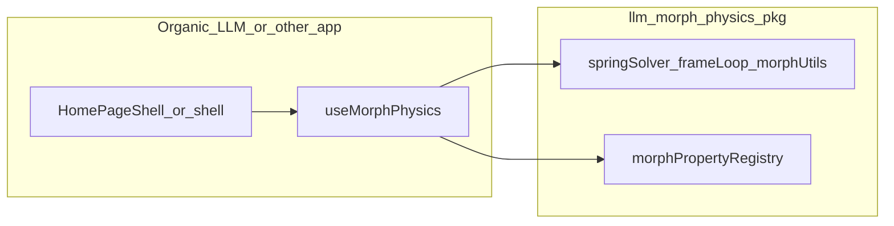

# Port morph physics to a shippable npm package (`llm/`)

## Repository layout (required)

All **published library code and package metadata** live under a **top-level folder `llm/`** at the git root. Example:

```text
/                          # git root — optional root README, .github, licenses
  llm/
    morph-physics/         # npm package root (name in package.json, e.g. @scope/morph-physics)
      package.json
      tsconfig.json
      tsup.config.ts
      src/
        ...
```

Rationale: reserves `llm/` for shipped libs; repo can later add sibling `docs/`, `examples/`, or additional packages under `llm/<other-pkg>/` without crowding the package tree.

## Directory structure inside the package (`llm/morph-physics/src/`)

**Optimal but stable:** mirror Nebulae’s proven tree so diffs stay small; only **relocate** the hook into a dedicated namespace.

```text
src/
  physics/             # frameLoop, springSolver (+ tests co-located)
  schemas/             # physicsSchemas, springSolverSchemas, webGLSchemas
  morph-properties/    # OPTIONAL: rename from morphProperties for readability; if rename, do a single consistent rename only — default is keep `morphProperties` to minimize change
  morphUtils.ts        # + morphUtils.test.ts
  constants.ts
  webgl/               # registry, meshRegistryContext, webGLUtils
  react/
    useMorphPhysics.ts
  index.ts             # core public API
  react.ts             # re-exports hook(s)
  webgl.ts             # optional public API
```

**Default per “relatively unchanged”:** keep the folder name **`morphProperties`** (camelCase) as in Nebulae unless a quick rename improves clarity without touching logic. The **`react/`** subfolder is the main structural addition so consumers see React boundaries clearly.

## Port quality: cleanup and comments

- **Cleanup (light):** consistent relative imports; remove or resolve stale TODOs only where trivial; guard `console.log` / `prettyPrintPhysicsState` behind `NODE_ENV !== "production"` (or remove debug logs).
- **Comments (additive):** do **not** restate obvious code. Add:
  - A **short file header** on each module (1–4 lines: responsibility, key invariants).
  - **Targeted blocks** where Nebulae code is dense: `FrameLoop` dt clamp and why; `solveSpring` ms→s; `morphPropertyRegistry` default registration side effect; `useMorphPhysics` tick order (validate → integrate → apply DOM → WebGL → settle).
  - **Public exports** in `index.ts` / `react.ts` / `webgl.ts`: one line each for intended consumer use.

**Behavior:** preserve algorithms, thresholds, and registry defaults unless a bugfix is unavoidable; call out any intentional change in a comment.

## Scope (what moves)

From `.project-references/nebulae/src/lib/morphTest/` in the Organic LLM workspace — all modules plus tests.

From `.project-references/nebulae/src/experiments/morph-lab/hooks/useMorphPhysics.ts` — into `src/react/useMorphPhysics.ts`.

**Do not** copy morph-lab demo UI into the library.

## Package `exports`

- `import { … } from "pkg"` — core
- `import { useMorphPhysics } from "pkg/react"`
- `import { … } from "pkg/webgl"` — Three-related helpers

## Dependencies

| Dependency | Role |
|------------|------|
| **peer:** `react` | Hook + `meshRegistryContext` |
| **peer:** `zod` | Must be explicit (missing in Nebulae’s package.json today) |
| **peer (optional):** `three` | WebGL path |

React: `^18.0.0 || ^19.0.0`.

## Mechanical port steps

1. Replace `@/` imports with **relative** paths inside `llm/.../src`.
2. **Side effects:** document registry initialization on import; optional follow-up `registerDefaultMorphProperties()` remains a later refinement.
3. **Circular imports:** if tsup fails, split pure geometry helpers from `morphUtils` only as needed.

## Build, tests, publish

- `tsup` (or unbuild): ESM + `dts`, sourcemaps; **`package.json` `files`: `dist`** under `llm/morph-physics/`.
- Port Vitest tests; CI from repo root or `llm/morph-physics`.
- Publish **`llm/morph-physics`** as the npm package directory (`npm publish` cwd = that folder).

## Consuming from Organic LLM

Add dependency to the main app `package.json`; update `.cursor/skills/nebulae-morph-physics/SKILL.md` to reference the **npm package** and **`llm/` repo layout**.

## Architecture (consumer view)


